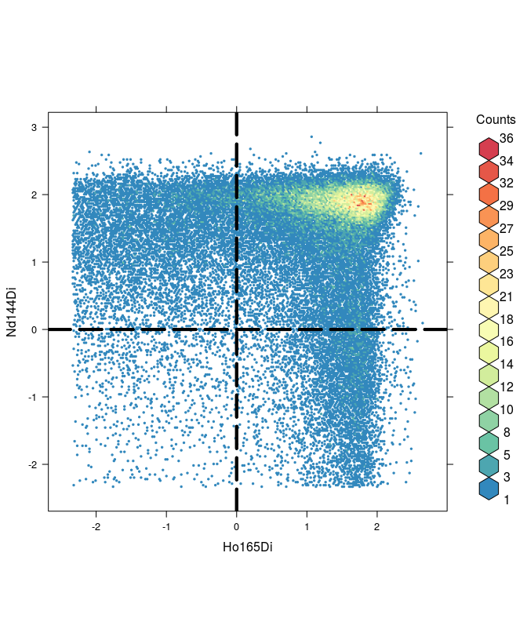
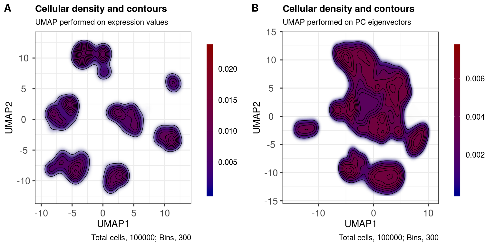
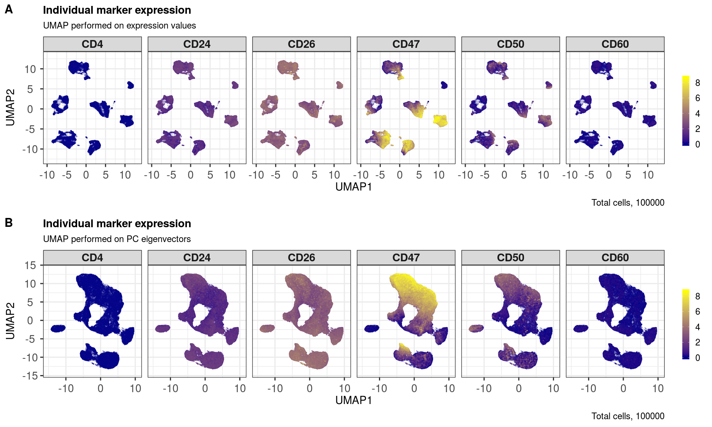
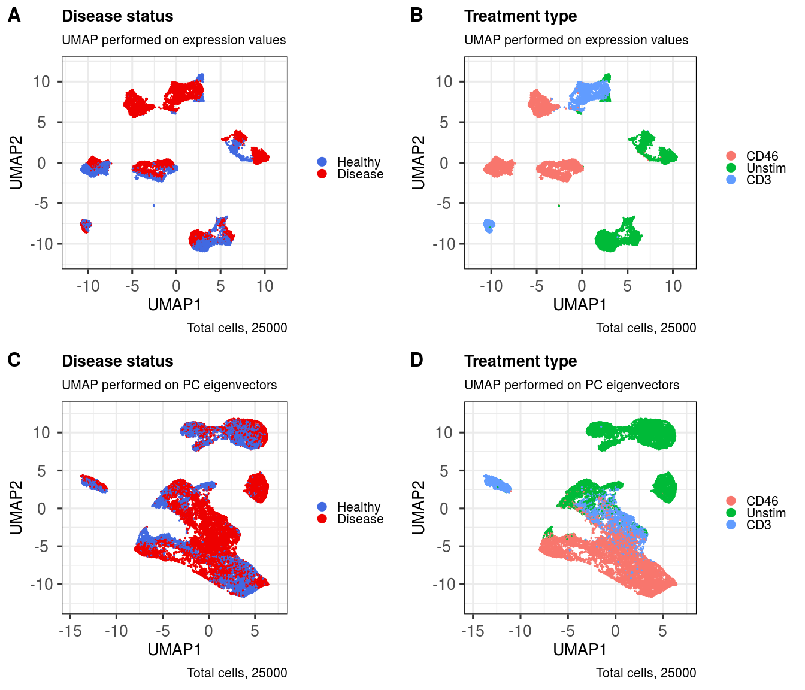
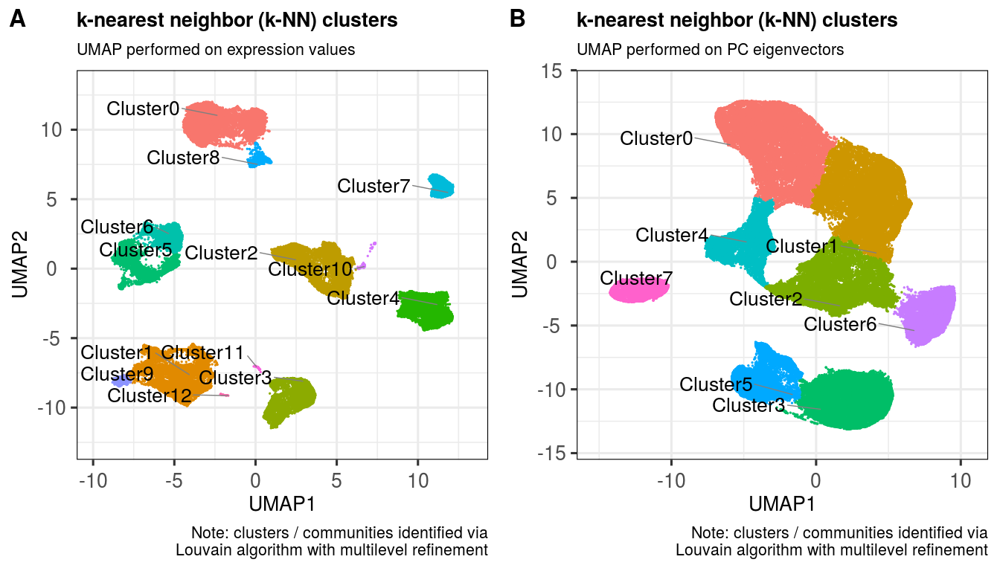
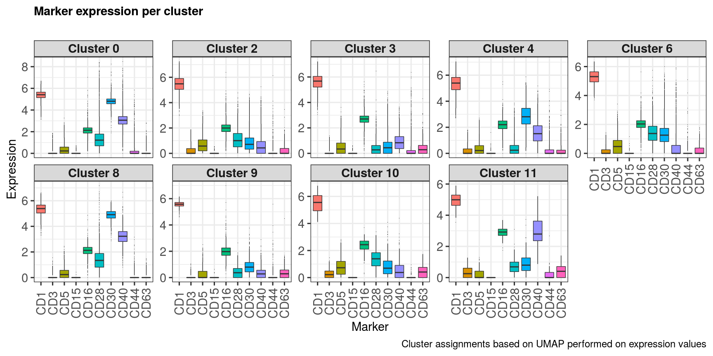
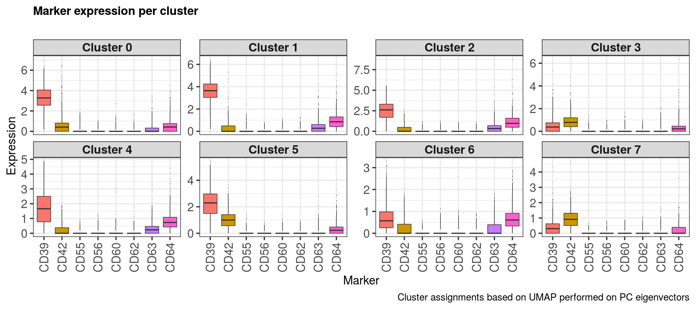
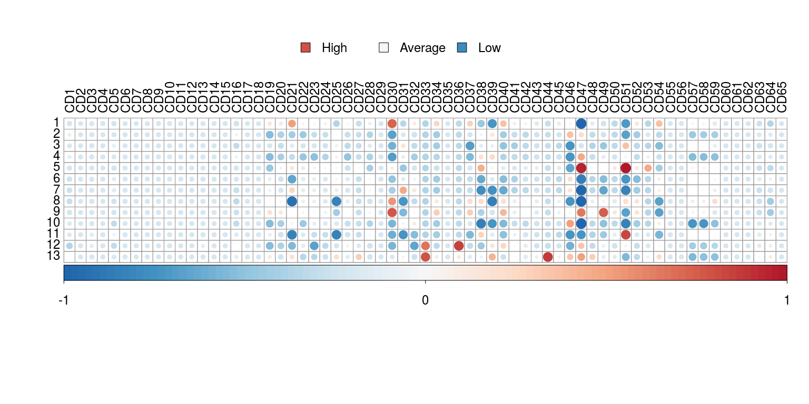
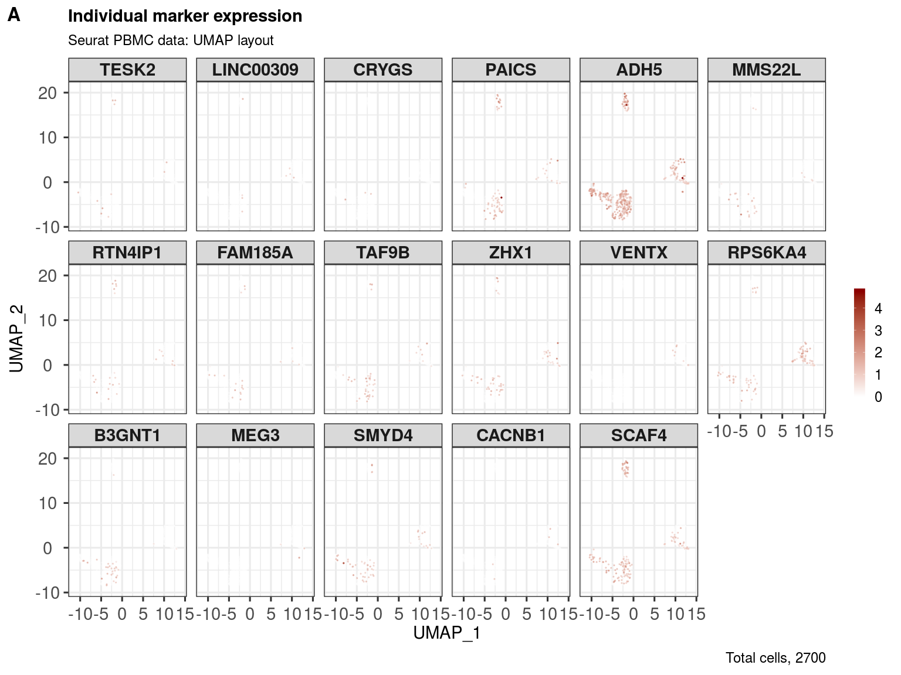
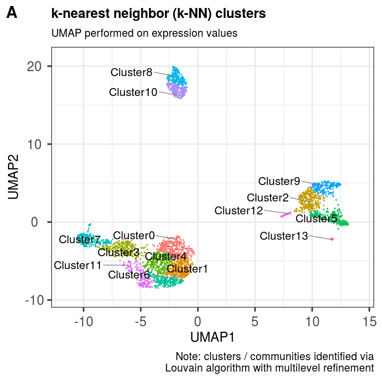

scDataviz: single cell dataviz and downstream analyses
================
Kevin Blighe
2020-02-09

-   [Introduction](#introduction)
-   [Installation](#installation)
    -   [1. Install from GitHub](#install-from-github)
    -   [2. Load the package into R session](#load-the-package-into-r-session)
-   [Tutorial 1: CyTOF FCS data](#tutorial-1-cytof-fcs-data)
    -   [Perform principal component analysis (PCA)](#perform-principal-component-analysis-pca)
    -   [Perform UMAP](#perform-umap)
    -   [Create a contour plot of the UMAP layout](#create-a-contour-plot-of-the-umap-layout)
    -   [Show marker expression across the layout](#show-marker-expression-across-the-layout)
    -   [Shade cells by metadata](#shade-cells-by-metadata)
    -   [Find ideal clusters in the UMAP layout via k-nearest neighbours](#find-ideal-clusters-in-the-umap-layout-via-k-nearest-neighbours)
    -   [Plot marker expression per identified cluster](#plot-marker-expression-per-identified-cluster)
    -   [Determine enriched markers in each cluster and plot the expression signature](#determine-enriched-markers-in-each-cluster-and-plot-the-expression-signature)
-   [Tutorial 2: Import from Seurat](#tutorial-2-import-from-seurat)
-   [Tutorial 3: Import any numerical data](#tutorial-3-import-any-numerical-data)
-   [Acknowledgments](#acknowledgments)
-   [Session info](#session-info)
-   [References](#references)

Introduction
============

In the single cell World, which includes flow cytometry, mass cytometry, single-cell RNA-seq (scRNA-seq), and others, there is a need to improve data visualisation and to bring analysis capabilities to researchers even from non-technical backgrounds. *scDataviz* (Blighe 2020) attempts to fit into this space, while also catering for advanced users. Additonally, due to the way that *scDataviz* is designed, which is based on *SingleCellExperiment* (Lun et al. 2019), it has a 'plug and play' feel, and immediately lends itself as flexibile and compatibile with studies that go beyond *scDataviz*. Finally, the graphics in *scDataviz* are generated via the *ggplot* (Wickham 2016) engine, which means that users can 'add on' features to these with ease.

Installation
============

1. Install from GitHub
----------------------

``` r
  devtools::install_github('kevinblighe/scDataviz')
```

2. Load the package into R session
----------------------------------

``` r
  library(scDataviz)
```

Tutorial 1: CyTOF FCS data
==========================

Here, we will start with sample data stored as FCS files. Specifically, we will utilise some of the data used in [Deep phenotyping detects a pathological CD4+ T-cell complosome signature in systemic sclerosis](https://www.nature.com/articles/s41423-019-0360-8).

In order to downlaod this data, we can use `git clone` from your command prompt:

``` bash

  git clone https://github.com/kevinblighe/Arbore2020_Tcell_Complosome ;
```

**NB - this command (above) needs to be run outside R at your shell's command prompt (e..g, BASH)**

Now, read in the data and normalise it. The `processFCS` command by default removes variables based on low variance and also downsamples \[randomly\] your data to 100000 variables. The user can change these via the `downsample` and `downsampleVar` parameters.

``` r
  filelist <- list.files(
    path = "Arbore2020_Tcell_Complosome/FCS/",
    pattern = "*.fcs|*.FCS",
    full.names = TRUE)
  filelist
```

    ##  [1] "Arbore2020_Tcell_Complosome/FCS//HD00 CD46.fcs"   
    ##  [2] "Arbore2020_Tcell_Complosome/FCS//HD00 Unstim.fcs" 
    ##  [3] "Arbore2020_Tcell_Complosome/FCS//HD01 CD46.fcs"   
    ##  [4] "Arbore2020_Tcell_Complosome/FCS//HD01 Unstim.fcs" 
    ##  [5] "Arbore2020_Tcell_Complosome/FCS//HD262 CD3.fcs"   
    ##  [6] "Arbore2020_Tcell_Complosome/FCS//HD262 CD46.fcs"  
    ##  [7] "Arbore2020_Tcell_Complosome/FCS//HD262 Unstim.fcs"
    ##  [8] "Arbore2020_Tcell_Complosome/FCS//P00 CD46.fcs"    
    ##  [9] "Arbore2020_Tcell_Complosome/FCS//P00 Unstim.fcs"  
    ## [10] "Arbore2020_Tcell_Complosome/FCS//P02 CD3.fcs"     
    ## [11] "Arbore2020_Tcell_Complosome/FCS//P02 CD46.fcs"    
    ## [12] "Arbore2020_Tcell_Complosome/FCS//P03 CD3.fcs"     
    ## [13] "Arbore2020_Tcell_Complosome/FCS//P03 CD46.fcs"    
    ## [14] "Arbore2020_Tcell_Complosome/FCS//P04 CD3.fcs"     
    ## [15] "Arbore2020_Tcell_Complosome/FCS//P04 CD46.fcs"    
    ## [16] "Arbore2020_Tcell_Complosome/FCS//P08 CD3.fcs"     
    ## [17] "Arbore2020_Tcell_Complosome/FCS//P08 CD46.fcs"    
    ## [18] "Arbore2020_Tcell_Complosome/FCS//P08 Unstim.fcs"

``` r
  metadata <- data.frame(
    sample = gsub('\\ [A-Za-z0-9]*\\.fcs$', '',
      gsub('Arbore2020_Tcell_Complosome\\/FCS\\/\\/', '', filelist)),
    group = c(rep('Healthy', 7), rep('Disease', 11)),
    treatment = gsub('\\.fcs$', '',
      gsub('Arbore2020_Tcell_Complosome\\/FCS\\/\\/[A-Z0-9]*\\ ', '', filelist)),
    row.names = filelist,
    stringsAsFactors = FALSE)
  metadata
```

    ##                                                   sample   group treatment
    ## Arbore2020_Tcell_Complosome/FCS//HD00 CD46.fcs      HD00 Healthy      CD46
    ## Arbore2020_Tcell_Complosome/FCS//HD00 Unstim.fcs    HD00 Healthy    Unstim
    ## Arbore2020_Tcell_Complosome/FCS//HD01 CD46.fcs      HD01 Healthy      CD46
    ## Arbore2020_Tcell_Complosome/FCS//HD01 Unstim.fcs    HD01 Healthy    Unstim
    ## Arbore2020_Tcell_Complosome/FCS//HD262 CD3.fcs     HD262 Healthy       CD3
    ## Arbore2020_Tcell_Complosome/FCS//HD262 CD46.fcs    HD262 Healthy      CD46
    ## Arbore2020_Tcell_Complosome/FCS//HD262 Unstim.fcs  HD262 Healthy    Unstim
    ## Arbore2020_Tcell_Complosome/FCS//P00 CD46.fcs        P00 Disease      CD46
    ## Arbore2020_Tcell_Complosome/FCS//P00 Unstim.fcs      P00 Disease    Unstim
    ## Arbore2020_Tcell_Complosome/FCS//P02 CD3.fcs         P02 Disease       CD3
    ## Arbore2020_Tcell_Complosome/FCS//P02 CD46.fcs        P02 Disease      CD46
    ## Arbore2020_Tcell_Complosome/FCS//P03 CD3.fcs         P03 Disease       CD3
    ## Arbore2020_Tcell_Complosome/FCS//P03 CD46.fcs        P03 Disease      CD46
    ## Arbore2020_Tcell_Complosome/FCS//P04 CD3.fcs         P04 Disease       CD3
    ## Arbore2020_Tcell_Complosome/FCS//P04 CD46.fcs        P04 Disease      CD46
    ## Arbore2020_Tcell_Complosome/FCS//P08 CD3.fcs         P08 Disease       CD3
    ## Arbore2020_Tcell_Complosome/FCS//P08 CD46.fcs        P08 Disease      CD46
    ## Arbore2020_Tcell_Complosome/FCS//P08 Unstim.fcs      P08 Disease    Unstim

``` r
  sce <- processFCS(
    files = filelist,
    metadata = metadata,
    transformation = TRUE,
    transFun = function (x) asinh(x),
    asinhFactor = 5,
    downsample = 100000,
    downsampleVar = 0.2,
    newColnames = paste0('CD', 1:65))
```

One can also create a new *SingleCellExperiment* object manually using any type of data, including any data-matrix from scRNA-seq produced elsewhere. Import functions for data deriving from popular programs will be covered in future tutorials, e.g., *Seurat*.

Perform principal component analysis (PCA)
------------------------------------------

We can use the *PCAtools* (Blighe and Lun 2018) package for the purpose of performing PCA.

``` r
  library(PCAtools)
  p <- pca(assay(sce, 'scaled'), metadata = metadata(sce))
  biplot(p,
    lab = NULL,
    pointSize = 0.5,
    colby = 'treatment',
    legendPosition = 'right',
    title = 'PCA applied to CyTOF data',
    caption = '100000 cells randomly selected after having filtered for low variance')
```



We can add the rotated component loadings as a new reduced dimensional component to our dataset. Let's just add the first 20 PCs.

``` r
  reducedDim(sce, 'PCA') <- p$rotated[,1:20]
```

For more functionality via *PCAtools*, check the vignette: [PCAtools: everything Principal Component Analysis](https://bioconductor.org/packages/release/bioc/vignettes/PCAtools/inst/doc/PCAtools.html)

Perform UMAP
------------

UMAP can be performed on the entire dataset, if your computer's memory will permit. Currently it's default is to use the data contained in the 'scaled' assay component of your *SingleCellExperiment* object.

``` r
  sce <- performUMAP(sce)
```

UMAP can also be stratified based on a column in your metadata, e.g., (treated versus untreated samples); however, to do this, I recommend creating separate *SingleCellExperiment* objects from the very start, i.e., from the the data input stage, and processing the data separately for each group.

We can also perform UMAP on a select number of PC eigenvectors. *PCAtools* (Blighe and Lun 2018) can be used to infer ideal number of dimensions to use via the elbow method and Horn's parallel analysis.

``` r
  elbow <- findElbowPoint(p$variance)
  horn <- parallelPCA(assay(sce, 'scaled'))

  elbow
```

    ## PC9 
    ##   9

``` r
  horn$n
```

    ## [1] 4

Let's use the number of PCs identified by Horn's.

``` r
  sce <- performUMAP(sce, reducedDim = 'PCA', dims = c(1:horn$n))
```

At this point, we have done a lot - let's save the dataset.

``` r
  dir.create('save')
  saveRDS(sce, 'save/FlowData.RDS', compress = TRUE)
```

Create a contour plot of the UMAP layout
----------------------------------------

This and the remaining sections in this tutorial are about producing great visualisations of the data and attempting to make sense of it, while not fully overlapping with functionalioty provided by other programs that operate in tis space.

With the contour plot, we are essentially looking at celluar density. It can provide for a beautiful viusualisation in a manuscript while also serving as a useful QC tool: if the density is 'scrunched up' into a single area in the plot space, then there are likely issues with your input data distribution. We want to see well-separated, high density 'islands', or, at least, gradual gradients that blend into one another across high density 'peaks'.

``` r
  ggout1 <- contourPlot(sce,
    reducedDim = 'UMAP',
    subtitle = 'UMAP performed on expression values',
    legendLabSize = 18,
    axisLabSize = 22,
    titleLabSize = 22,
    subtitleLabSize = 18,
    captionLabSize = 18)

  ggout2 <- contourPlot(sce,
    reducedDim = 'UMAP_PCA',
    subtitle = 'UMAP performed on PC eigenvectors',
    legendLabSize = 18,
    axisLabSize = 22,
    titleLabSize = 22,
    subtitleLabSize = 18,
    captionLabSize = 18)

  plot_grid(ggout1, ggout2,
    labels = c('A','B'),
    ncol = 2, align = "l", label_size = 24)
```



Show marker expression across the layout
----------------------------------------

Here, we randomly select some markers and then plot their expression profiles across the UMAP layouts.

``` r
  markers <- sample(rownames(sce), 6)
  markers
```

    ## [1] "CD44" "CD1"  "CD51" "CD52" "CD20" "CD25"

``` r
  ggout1 <- markerExpression(sce,
    markers = markers,
    subtitle = 'UMAP performed on expression values',
    nrow = 1, ncol = 6,
    legendKeyHeight = 1.0,
    legendLabSize = 18,
    stripLabSize = 22,
    axisLabSize = 22,
    titleLabSize = 22,
    subtitleLabSize = 18,
    captionLabSize = 18)

  ggout2 <-  markerExpression(sce,
    markers = markers,
    reducedDim = 'UMAP_PCA',
    subtitle = 'UMAP performed on PC eigenvectors',
    nrow = 1, ncol = 6,
    legendKeyHeight = 1.0,
    legendLabSize = 18,
    stripLabSize = 22,
    axisLabSize = 22,
    titleLabSize = 22,
    subtitleLabSize = 18,
    captionLabSize = 18)

  plot_grid(ggout1, ggout2,
    labels = c('A','B'),
    nrow = 2, align = "l", label_size = 24)
```



Shade cells by metadata
-----------------------

Shading cells by metadata can be useful for identifying any batch effects, but also useful for visualising, e.g., differences across treatments.

First, let's take a look inside the metadata that we have.

``` r
  head(metadata(sce))
```

    ##       sample   group treatment
    ## cell1    P00 Disease      CD46
    ## cell2  HD262 Healthy    Unstim
    ## cell3    P08 Disease      CD46
    ## cell4    P04 Disease      CD46
    ## cell5    P08 Disease      CD46
    ## cell6    P00 Disease    Unstim

``` r
  levels(metadata(sce)$group)
```

    ## [1] "Healthy" "Disease"

``` r
  levels(metadata(sce)$treatment)
```

    ## [1] "CD46"   "Unstim" "CD3"

``` r
  ggout1 <- metadataPlot(sce,
    colby = 'group',
    colkey = c(Healthy = 'royalblue', Disease = 'red2'),
    title = 'Disease status',
    subtitle = 'UMAP performed on expression values',
    legendLabSize = 16,
    axisLabSize = 20,
    titleLabSize = 20,
    subtitleLabSize = 16,
    captionLabSize = 16)

  ggout2 <- metadataPlot(sce,
    reducedDim = 'UMAP_PCA',
    colby = 'group',
    colkey = c(Healthy = 'royalblue', Disease = 'red2'),
    title = 'Disease status',
    subtitle = 'UMAP performed on PC eigenvectors',
    legendLabSize = 16,
    axisLabSize = 20,
    titleLabSize = 20,
    subtitleLabSize = 16,
    captionLabSize = 16)

  ggout3 <- metadataPlot(sce,
    colby = 'treatment',
    title = 'Treatment type',
    subtitle = 'UMAP performed on expression values',
    legendLabSize = 16,
    axisLabSize = 20,
    titleLabSize = 20,
    subtitleLabSize = 16,
    captionLabSize = 16)

  ggout4 <- metadataPlot(sce,
    reducedDim = 'UMAP_PCA',
    colby = 'treatment',
    title = 'Treatment type',
    subtitle = 'UMAP performed on PC eigenvectors',
    legendLabSize = 16,
    axisLabSize = 20,
    titleLabSize = 20,
    subtitleLabSize = 16,
    captionLabSize = 16)

  plot_grid(ggout1, ggout3, ggout2, ggout4,
    labels = c('A','B','C','D'),
    nrow = 2, ncol = 2, align = "l", label_size = 24)
```



Find ideal clusters in the UMAP layout via k-nearest neighbours
---------------------------------------------------------------

This function utilises the k nearest neighbours (k-NN) approach from Seurat, which works quite well on flow cytometry and CyTOF UMAP layouts, from my experience.

``` r
  sce <- clusKNN(sce,
    k.param = 20,
    prune.SNN = 1/15,
    resolution = 0.01,
    algorithm = 2)
```

    ## Modularity Optimizer version 1.3.0 by Ludo Waltman and Nees Jan van Eck
    ## 
    ## Number of nodes: 100000
    ## Number of edges: 2240709
    ## 
    ## Running Louvain algorithm with multilevel refinement...
    ## Maximum modularity in 10 random starts: 0.9985
    ## Number of communities: 13
    ## Elapsed time: 23 seconds

``` r
  sce <- clusKNN(sce,
    reducedDim = 'UMAP_PCA',
    clusterAssignName = 'Cluster_PCA',
    k.param = 20,
    prune.SNN = 1/15,
    resolution = 0.01,
    algorithm = 2)
```

    ## Modularity Optimizer version 1.3.0 by Ludo Waltman and Nees Jan van Eck
    ## 
    ## Number of nodes: 100000
    ## Number of edges: 2199055
    ## 
    ## Running Louvain algorithm with multilevel refinement...
    ## Maximum modularity in 10 random starts: 0.9974
    ## Number of communities: 8
    ## Elapsed time: 22 seconds

``` r
  ggout1 <- plotClusters(sce,
    clusterColname = 'Cluster',
    labSize = 7.0,
    subtitle = 'UMAP performed on expression values',
    caption = paste0('Note: clusters / communities identified via',
      '\nLouvain algorithm with multilevel refinement'),
    axisLabSize = 20,
    titleLabSize = 20,
    subtitleLabSize = 16,
    captionLabSize = 16)

  ggout2 <- plotClusters(sce,
    clusterColname = 'Cluster_PCA',
    reducedDim = 'UMAP_PCA',
    labSize = 7.0,
    subtitle = 'UMAP performed on PC eigenvectors',
    caption = paste0('Note: clusters / communities identified via',
      '\nLouvain algorithm with multilevel refinement'),
    axisLabSize = 20,
    titleLabSize = 20,
    subtitleLabSize = 16,
    captionLabSize = 16)

  plot_grid(ggout1, ggout2,
    labels = c('A','B'),
    ncol = 2, align = "l", label_size = 24)
```



Plot marker expression per identified cluster
---------------------------------------------

``` r
  markerExpressionPerCluster(sce,
    caption = 'Cluster assignments based on UMAP performed on expression values',
    stripLabSize = 22,
    axisLabSize = 22,
    titleLabSize = 22,
    subtitleLabSize = 18,
    captionLabSize = 18)
```



``` r
  markerExpressionPerCluster(sce,
    clusters = unique(metadata(sce)[['Cluster_PCA']]),
    clusterVector = metadata(sce)[['Cluster_PCA']],
    markers = sample(rownames(sce), 8),
    nrow = 2, ncol = 4,
    caption = 'Cluster assignments based on UMAP performed on PC eigenvectors',
    stripLabSize = 22,
    axisLabSize = 22,
    titleLabSize = 22,
    subtitleLabSize = 18,
    captionLabSize = 18)
```



Determine enriched markers in each cluster and plot the expression signature
----------------------------------------------------------------------------

This method also calculates metacluster abundances across a chosen phenotype. The function returns a data-frame, which can then be exported to do other analyses.

### Disease vs Healthy metacluster abundances

<table class="table" style="width: auto !important; margin-left: auto; margin-right: auto;">
<thead>
<tr>
<th style="text-align:right;">
Cluster
</th>
<th style="text-align:right;">
nCells
</th>
<th style="text-align:right;">
TotalCells
</th>
<th style="text-align:right;">
PercentCells
</th>
<th style="text-align:left;">
NegMarkers
</th>
<th style="text-align:left;">
PosMarkers
</th>
<th style="text-align:right;">
PerCent\_Healthy
</th>
<th style="text-align:right;">
PerCent\_Disease
</th>
<th style="text-align:right;">
nCell\_Healthy
</th>
<th style="text-align:right;">
nCell\_Disease
</th>
</tr>
</thead>
<tbody>
<tr>
<td style="text-align:right;">
0
</td>
<td style="text-align:right;">
21172
</td>
<td style="text-align:right;">
1e+05
</td>
<td style="text-align:right;">
21.172
</td>
<td style="text-align:left;">
NA
</td>
<td style="text-align:left;">
NA
</td>
<td style="text-align:right;">
62.2850935
</td>
<td style="text-align:right;">
37.714906
</td>
<td style="text-align:right;">
13187
</td>
<td style="text-align:right;">
7985
</td>
</tr>
<tr>
<td style="text-align:right;">
1
</td>
<td style="text-align:right;">
16052
</td>
<td style="text-align:right;">
1e+05
</td>
<td style="text-align:right;">
16.052
</td>
<td style="text-align:left;">
CD47-
</td>
<td style="text-align:left;">
CD30+
</td>
<td style="text-align:right;">
13.2693745
</td>
<td style="text-align:right;">
86.730626
</td>
<td style="text-align:right;">
2130
</td>
<td style="text-align:right;">
13922
</td>
</tr>
<tr>
<td style="text-align:right;">
2
</td>
<td style="text-align:right;">
15534
</td>
<td style="text-align:right;">
1e+05
</td>
<td style="text-align:right;">
15.534
</td>
<td style="text-align:left;">
CD30-CD51-
</td>
<td style="text-align:left;">
CD46+
</td>
<td style="text-align:right;">
31.8012102
</td>
<td style="text-align:right;">
68.198790
</td>
<td style="text-align:right;">
4940
</td>
<td style="text-align:right;">
10594
</td>
</tr>
<tr>
<td style="text-align:right;">
3
</td>
<td style="text-align:right;">
11737
</td>
<td style="text-align:right;">
1e+05
</td>
<td style="text-align:right;">
11.737
</td>
<td style="text-align:left;">
CD37-CD46-
</td>
<td style="text-align:left;">
CD51+
</td>
<td style="text-align:right;">
0.1789214
</td>
<td style="text-align:right;">
99.821079
</td>
<td style="text-align:right;">
21
</td>
<td style="text-align:right;">
11716
</td>
</tr>
<tr>
<td style="text-align:right;">
4
</td>
<td style="text-align:right;">
11390
</td>
<td style="text-align:right;">
1e+05
</td>
<td style="text-align:right;">
11.390
</td>
<td style="text-align:left;">
CD30-CD46-
</td>
<td style="text-align:left;">
CD47+
</td>
<td style="text-align:right;">
77.3397717
</td>
<td style="text-align:right;">
22.660228
</td>
<td style="text-align:right;">
8809
</td>
<td style="text-align:right;">
2581
</td>
</tr>
<tr>
<td style="text-align:right;">
5
</td>
<td style="text-align:right;">
8712
</td>
<td style="text-align:right;">
1e+05
</td>
<td style="text-align:right;">
8.712
</td>
<td style="text-align:left;">
CD46-
</td>
<td style="text-align:left;">
CD47+CD51+
</td>
<td style="text-align:right;">
46.2695133
</td>
<td style="text-align:right;">
53.730487
</td>
<td style="text-align:right;">
4031
</td>
<td style="text-align:right;">
4681
</td>
</tr>
<tr>
<td style="text-align:right;">
6
</td>
<td style="text-align:right;">
7352
</td>
<td style="text-align:right;">
1e+05
</td>
<td style="text-align:right;">
7.352
</td>
<td style="text-align:left;">
CD47-
</td>
<td style="text-align:left;">
CD46+
</td>
<td style="text-align:right;">
0.9521219
</td>
<td style="text-align:right;">
99.047878
</td>
<td style="text-align:right;">
70
</td>
<td style="text-align:right;">
7282
</td>
</tr>
<tr>
<td style="text-align:right;">
7
</td>
<td style="text-align:right;">
3410
</td>
<td style="text-align:right;">
1e+05
</td>
<td style="text-align:right;">
3.410
</td>
<td style="text-align:left;">
CD47-
</td>
<td style="text-align:left;">
CD31+
</td>
<td style="text-align:right;">
55.6011730
</td>
<td style="text-align:right;">
44.398827
</td>
<td style="text-align:right;">
1896
</td>
<td style="text-align:right;">
1514
</td>
</tr>
<tr>
<td style="text-align:right;">
8
</td>
<td style="text-align:right;">
2206
</td>
<td style="text-align:right;">
1e+05
</td>
<td style="text-align:right;">
2.206
</td>
<td style="text-align:left;">
CD21-CD47-
</td>
<td style="text-align:left;">
CD30+
</td>
<td style="text-align:right;">
67.7697189
</td>
<td style="text-align:right;">
32.230281
</td>
<td style="text-align:right;">
1495
</td>
<td style="text-align:right;">
711
</td>
</tr>
<tr>
<td style="text-align:right;">
9
</td>
<td style="text-align:right;">
2063
</td>
<td style="text-align:right;">
1e+05
</td>
<td style="text-align:right;">
2.063
</td>
<td style="text-align:left;">
CD51-CD54-
</td>
<td style="text-align:left;">
CD30+CD49+
</td>
<td style="text-align:right;">
97.0916142
</td>
<td style="text-align:right;">
2.908386
</td>
<td style="text-align:right;">
2003
</td>
<td style="text-align:right;">
60
</td>
</tr>
<tr>
<td style="text-align:right;">
10
</td>
<td style="text-align:right;">
261
</td>
<td style="text-align:right;">
1e+05
</td>
<td style="text-align:right;">
0.261
</td>
<td style="text-align:left;">
CD47-
</td>
<td style="text-align:left;">
CD46+
</td>
<td style="text-align:right;">
98.8505747
</td>
<td style="text-align:right;">
1.149425
</td>
<td style="text-align:right;">
258
</td>
<td style="text-align:right;">
3
</td>
</tr>
<tr>
<td style="text-align:right;">
11
</td>
<td style="text-align:right;">
87
</td>
<td style="text-align:right;">
1e+05
</td>
<td style="text-align:right;">
0.087
</td>
<td style="text-align:left;">
CD21-CD25-
</td>
<td style="text-align:left;">
CD51+
</td>
<td style="text-align:right;">
0.0000000
</td>
<td style="text-align:right;">
100.000000
</td>
<td style="text-align:right;">
0
</td>
<td style="text-align:right;">
87
</td>
</tr>
<tr>
<td style="text-align:right;">
12
</td>
<td style="text-align:right;">
24
</td>
<td style="text-align:right;">
1e+05
</td>
<td style="text-align:right;">
0.024
</td>
<td style="text-align:left;">
CD23-CD32-CD46-
</td>
<td style="text-align:left;">
CD36+
</td>
<td style="text-align:right;">
4.1666667
</td>
<td style="text-align:right;">
95.833333
</td>
<td style="text-align:right;">
1
</td>
<td style="text-align:right;">
23
</td>
</tr>
</tbody>
</table>
.

### Treatment type metacluster abundances

<table class="table" style="width: auto !important; margin-left: auto; margin-right: auto;">
<thead>
<tr>
<th style="text-align:right;">
Cluster
</th>
<th style="text-align:right;">
nCells
</th>
<th style="text-align:right;">
TotalCells
</th>
<th style="text-align:right;">
PercentCells
</th>
<th style="text-align:left;">
NegMarkers
</th>
<th style="text-align:left;">
PosMarkers
</th>
<th style="text-align:right;">
PerCent\_CD46
</th>
<th style="text-align:right;">
PerCent\_Unstim
</th>
<th style="text-align:right;">
PerCent\_CD3
</th>
<th style="text-align:right;">
nCell\_CD46
</th>
<th style="text-align:right;">
nCell\_Unstim
</th>
<th style="text-align:right;">
nCell\_CD3
</th>
</tr>
</thead>
<tbody>
<tr>
<td style="text-align:right;">
0
</td>
<td style="text-align:right;">
21172
</td>
<td style="text-align:right;">
1e+05
</td>
<td style="text-align:right;">
21.172
</td>
<td style="text-align:left;">
NA
</td>
<td style="text-align:left;">
NA
</td>
<td style="text-align:right;">
0.0047232
</td>
<td style="text-align:right;">
99.9622142
</td>
<td style="text-align:right;">
0.0330625
</td>
<td style="text-align:right;">
1
</td>
<td style="text-align:right;">
21164
</td>
<td style="text-align:right;">
7
</td>
</tr>
<tr>
<td style="text-align:right;">
1
</td>
<td style="text-align:right;">
16052
</td>
<td style="text-align:right;">
1e+05
</td>
<td style="text-align:right;">
16.052
</td>
<td style="text-align:left;">
CD47-
</td>
<td style="text-align:left;">
CD30+
</td>
<td style="text-align:right;">
0.3800150
</td>
<td style="text-align:right;">
13.2569150
</td>
<td style="text-align:right;">
86.3630700
</td>
<td style="text-align:right;">
61
</td>
<td style="text-align:right;">
2128
</td>
<td style="text-align:right;">
13863
</td>
</tr>
<tr>
<td style="text-align:right;">
2
</td>
<td style="text-align:right;">
15534
</td>
<td style="text-align:right;">
1e+05
</td>
<td style="text-align:right;">
15.534
</td>
<td style="text-align:left;">
CD30-CD51-
</td>
<td style="text-align:left;">
CD46+
</td>
<td style="text-align:right;">
99.8841251
</td>
<td style="text-align:right;">
0.0772499
</td>
<td style="text-align:right;">
0.0386250
</td>
<td style="text-align:right;">
15516
</td>
<td style="text-align:right;">
12
</td>
<td style="text-align:right;">
6
</td>
</tr>
<tr>
<td style="text-align:right;">
3
</td>
<td style="text-align:right;">
11737
</td>
<td style="text-align:right;">
1e+05
</td>
<td style="text-align:right;">
11.737
</td>
<td style="text-align:left;">
CD37-CD46-
</td>
<td style="text-align:left;">
CD51+
</td>
<td style="text-align:right;">
99.2246741
</td>
<td style="text-align:right;">
0.0000000
</td>
<td style="text-align:right;">
0.7753259
</td>
<td style="text-align:right;">
11646
</td>
<td style="text-align:right;">
0
</td>
<td style="text-align:right;">
91
</td>
</tr>
<tr>
<td style="text-align:right;">
4
</td>
<td style="text-align:right;">
11390
</td>
<td style="text-align:right;">
1e+05
</td>
<td style="text-align:right;">
11.390
</td>
<td style="text-align:left;">
CD30-CD46-
</td>
<td style="text-align:left;">
CD47+
</td>
<td style="text-align:right;">
99.9385426
</td>
<td style="text-align:right;">
0.0263389
</td>
<td style="text-align:right;">
0.0351185
</td>
<td style="text-align:right;">
11383
</td>
<td style="text-align:right;">
3
</td>
<td style="text-align:right;">
4
</td>
</tr>
<tr>
<td style="text-align:right;">
5
</td>
<td style="text-align:right;">
8712
</td>
<td style="text-align:right;">
1e+05
</td>
<td style="text-align:right;">
8.712
</td>
<td style="text-align:left;">
CD46-
</td>
<td style="text-align:left;">
CD47+CD51+
</td>
<td style="text-align:right;">
0.4361800
</td>
<td style="text-align:right;">
99.4260790
</td>
<td style="text-align:right;">
0.1377410
</td>
<td style="text-align:right;">
38
</td>
<td style="text-align:right;">
8662
</td>
<td style="text-align:right;">
12
</td>
</tr>
<tr>
<td style="text-align:right;">
6
</td>
<td style="text-align:right;">
7352
</td>
<td style="text-align:right;">
1e+05
</td>
<td style="text-align:right;">
7.352
</td>
<td style="text-align:left;">
CD47-
</td>
<td style="text-align:left;">
CD46+
</td>
<td style="text-align:right;">
0.2992383
</td>
<td style="text-align:right;">
99.6735582
</td>
<td style="text-align:right;">
0.0272035
</td>
<td style="text-align:right;">
22
</td>
<td style="text-align:right;">
7328
</td>
<td style="text-align:right;">
2
</td>
</tr>
<tr>
<td style="text-align:right;">
7
</td>
<td style="text-align:right;">
3410
</td>
<td style="text-align:right;">
1e+05
</td>
<td style="text-align:right;">
3.410
</td>
<td style="text-align:left;">
CD47-
</td>
<td style="text-align:left;">
CD31+
</td>
<td style="text-align:right;">
0.0586510
</td>
<td style="text-align:right;">
0.0879765
</td>
<td style="text-align:right;">
99.8533724
</td>
<td style="text-align:right;">
2
</td>
<td style="text-align:right;">
3
</td>
<td style="text-align:right;">
3405
</td>
</tr>
<tr>
<td style="text-align:right;">
8
</td>
<td style="text-align:right;">
2206
</td>
<td style="text-align:right;">
1e+05
</td>
<td style="text-align:right;">
2.206
</td>
<td style="text-align:left;">
CD21-CD47-
</td>
<td style="text-align:left;">
CD30+
</td>
<td style="text-align:right;">
0.0906618
</td>
<td style="text-align:right;">
99.9093382
</td>
<td style="text-align:right;">
0.0000000
</td>
<td style="text-align:right;">
2
</td>
<td style="text-align:right;">
2204
</td>
<td style="text-align:right;">
0
</td>
</tr>
<tr>
<td style="text-align:right;">
9
</td>
<td style="text-align:right;">
2063
</td>
<td style="text-align:right;">
1e+05
</td>
<td style="text-align:right;">
2.063
</td>
<td style="text-align:left;">
CD51-CD54-
</td>
<td style="text-align:left;">
CD30+CD49+
</td>
<td style="text-align:right;">
0.0000000
</td>
<td style="text-align:right;">
97.0916142
</td>
<td style="text-align:right;">
2.9083858
</td>
<td style="text-align:right;">
0
</td>
<td style="text-align:right;">
2003
</td>
<td style="text-align:right;">
60
</td>
</tr>
<tr>
<td style="text-align:right;">
10
</td>
<td style="text-align:right;">
261
</td>
<td style="text-align:right;">
1e+05
</td>
<td style="text-align:right;">
0.261
</td>
<td style="text-align:left;">
CD47-
</td>
<td style="text-align:left;">
CD46+
</td>
<td style="text-align:right;">
52.4904215
</td>
<td style="text-align:right;">
47.5095785
</td>
<td style="text-align:right;">
0.0000000
</td>
<td style="text-align:right;">
137
</td>
<td style="text-align:right;">
124
</td>
<td style="text-align:right;">
0
</td>
</tr>
<tr>
<td style="text-align:right;">
11
</td>
<td style="text-align:right;">
87
</td>
<td style="text-align:right;">
1e+05
</td>
<td style="text-align:right;">
0.087
</td>
<td style="text-align:left;">
CD21-CD25-
</td>
<td style="text-align:left;">
CD51+
</td>
<td style="text-align:right;">
63.2183908
</td>
<td style="text-align:right;">
0.0000000
</td>
<td style="text-align:right;">
36.7816092
</td>
<td style="text-align:right;">
55
</td>
<td style="text-align:right;">
0
</td>
<td style="text-align:right;">
32
</td>
</tr>
<tr>
<td style="text-align:right;">
12
</td>
<td style="text-align:right;">
24
</td>
<td style="text-align:right;">
1e+05
</td>
<td style="text-align:right;">
0.024
</td>
<td style="text-align:left;">
CD23-CD32-CD46-
</td>
<td style="text-align:left;">
CD36+
</td>
<td style="text-align:right;">
45.8333333
</td>
<td style="text-align:right;">
4.1666667
</td>
<td style="text-align:right;">
50.0000000
</td>
<td style="text-align:right;">
11
</td>
<td style="text-align:right;">
1
</td>
<td style="text-align:right;">
12
</td>
</tr>
</tbody>
</table>
.

### Expression signature

The expression signature is a quick way to visualise which markers are more or less expressed in each identified cluster of cells.

``` r
  plotSignatures(sce,
    cexlab = 1.5,
    cexlegend = 1.5)
```



Tutorial 2: Import from Seurat
==============================

Due to the fact that *scDataviz* is based on *SingleCellExperiment*, it has increased interoperability with other packages, including the popular *Seurat* (Stuart et al. 2018). Taking the data produced from the [Seurat Tutorial](https://satijalab.org/seurat/v3.1/pbmc3k_tutorial.html) on Peripheral Blood Mononuclear Cells (PBMCs), we can do this as follows:

``` r
  require(Seurat)
  require(SingleCellExperiment)
  require(scDataviz)

  pbmc <- readRDS('pbmc3k_final.rds')
  pbmc.sce <- as.SingleCellExperiment(pbmc)

  assays(pbmc.sce)
```

    ## List of length 2
    ## names(2): counts logcounts

``` r
  head(metadata(pbmc.sce))
```

    ## list()

Let's check the reduced dimensions and then plot some randomly selected marker expression profiles across these.

``` r
  reducedDims(pbmc.sce)
```

    ## List of length 2
    ## names(2): PCA UMAP

``` r
  head(reducedDim(pbmc.sce, 'UMAP'))
```

    ##                   UMAP_1    UMAP_2
    ## AAACATACAACCAC -4.136650 -5.002530
    ## AAACATTGAGCTAC -1.368039 16.187368
    ## AAACATTGATCAGC -1.899821 -2.233947
    ## AAACCGTGCTTCCG 11.393142  1.269737
    ## AAACCGTGTATGCG -9.984254 -3.002492
    ## AAACGCACTGGTAC -2.112035 -5.860135

``` r
  head(reducedDim(pbmc.sce, 'PCA'))[,1:5]
```

    ##                       PC_1        PC_2       PC_3       PC_4       PC_5
    ## AAACATACAACCAC   4.6060466 -0.60371951 -0.6052429 -1.7231935 -0.7443433
    ## AAACATTGAGCTAC   0.1670809  4.54421712  6.4518867  6.8597974 -0.8011412
    ## AAACATTGATCAGC   2.6455614 -4.00971883 -0.3723479 -0.9960236 -4.9837032
    ## AAACCGTGCTTCCG -11.8569587  0.06340912  0.6226992 -0.2431955  0.2919980
    ## AAACCGTGTATGCG   3.0531940 -6.00216498  0.8234015  2.0463393  8.2465179
    ## AAACGCACTGGTAC   2.6832368  1.37196098 -0.5872163 -2.2090349 -2.5291571

``` r
  markers <- sample(rownames(pbmc.sce), 18)
  markers
```

    ##  [1] "CDCA4"       "CNN2"        "GUCY1A3"     "HIP1"        "ZNF3"       
    ##  [6] "FXYD5"       "TMEM208"     "DCPS"        "CYB561D2"    "ANKS1B"     
    ## [11] "RP1-315G1.3" "PCBP2"       "SEC22C"      "PSMB8"       "ZNF564"     
    ## [16] "EHBP1"       "SDK2"        "MT-ND1"

``` r
  ggout <- markerExpression(pbmc.sce,
    assay = 'logcounts',
    markers = markers,
    reducedDim = 'UMAP',
    dimColnames = c('UMAP_1','UMAP_2'),
    col = c('cornsilk1', 'darkred'),
    subtitle = 'Seurat PBMC data: UMAP layout',
    nrow = 3, ncol = 6,
    legendKeyHeight = 1.0,
    legendLabSize = 18,
    stripLabSize = 22,
    axisLabSize = 22,
    titleLabSize = 22,
    subtitleLabSize = 18,
    captionLabSize = 18)

  require(cowplot)
  plot_grid(ggout,
    labels = c('A'),
    nrow = 1, align = "l", label_size = 24)
```



We can also derive clusters using the same k-NN approach as before. Here, we are dealing with scRNA-seq data; so, let's relax the `resolution` threshold somewhat, which will permit more clusters to be identified.

``` r
  pbmc.sce <- clusKNN(pbmc.sce,
    reducedDim = 'UMAP',
    dimColnames = c('UMAP_1','UMAP_2'),
    k.param = 20,
    prune.SNN = 1/15,
    resolution = 0.5,
    algorithm = 2)
```

    ## Modularity Optimizer version 1.3.0 by Ludo Waltman and Nees Jan van Eck
    ## 
    ## Number of nodes: 2700
    ## Number of edges: 59214
    ## 
    ## Running Louvain algorithm with multilevel refinement...
    ## Maximum modularity in 10 random starts: 0.9231
    ## Number of communities: 14
    ## Elapsed time: 0 seconds

``` r
  ggout <- plotClusters(pbmc.sce,
    clusterColname = 'Cluster',
    labSize = 6.0,
    subtitle = 'UMAP performed on expression values',
    caption = paste0('Note: clusters / communities identified via',
      '\nLouvain algorithm with multilevel refinement'),
    axisLabSize = 20,
    titleLabSize = 20,
    subtitleLabSize = 16,
    captionLabSize = 16)

  plot_grid(ggout,
    labels = c('A'),
    ncol = 1, align = "l", label_size = 24)
```



Now determine enriched markers per cluster.

<table class="table" style="width: auto !important; margin-left: auto; margin-right: auto;">
<thead>
<tr>
<th style="text-align:right;">
Cluster
</th>
<th style="text-align:right;">
nCells
</th>
<th style="text-align:right;">
TotalCells
</th>
<th style="text-align:right;">
PercentCells
</th>
<th style="text-align:left;">
NegMarkers
</th>
<th style="text-align:left;">
PosMarkers
</th>
<th style="text-align:right;">
PerCent\_13
</th>
<th style="text-align:right;">
nCell\_13
</th>
</tr>
</thead>
<tbody>
<tr>
<td style="text-align:right;">
0
</td>
<td style="text-align:right;">
316
</td>
<td style="text-align:right;">
2700
</td>
<td style="text-align:right;">
11.7037037
</td>
<td style="text-align:left;">
NA
</td>
<td style="text-align:left;">
NA
</td>
<td style="text-align:right;">
100
</td>
<td style="text-align:right;">
316
</td>
</tr>
<tr>
<td style="text-align:right;">
1
</td>
<td style="text-align:right;">
271
</td>
<td style="text-align:right;">
2700
</td>
<td style="text-align:right;">
10.0370370
</td>
<td style="text-align:left;">
HLA-DRA-
</td>
<td style="text-align:left;">
LTB+CD3D+IL32+
</td>
<td style="text-align:right;">
100
</td>
<td style="text-align:right;">
271
</td>
</tr>
<tr>
<td style="text-align:right;">
2
</td>
<td style="text-align:right;">
254
</td>
<td style="text-align:right;">
2700
</td>
<td style="text-align:right;">
9.4074074
</td>
<td style="text-align:left;">
HLA-DRA-LYZ-
</td>
<td style="text-align:left;">
BTG2+CYTIP+FYB+NDFIP1+GIMAP5+LEPROTL1+CD3E+CD3D+LDHB+CCR7+NOSIP+PIK3IP1+ST13+
</td>
<td style="text-align:right;">
100
</td>
<td style="text-align:right;">
254
</td>
</tr>
<tr>
<td style="text-align:right;">
3
</td>
<td style="text-align:right;">
246
</td>
<td style="text-align:right;">
2700
</td>
<td style="text-align:right;">
9.1111111
</td>
<td style="text-align:left;">
LTB-
</td>
<td style="text-align:left;">
S100A9+LYZ+
</td>
<td style="text-align:right;">
100
</td>
<td style="text-align:right;">
246
</td>
</tr>
<tr>
<td style="text-align:right;">
4
</td>
<td style="text-align:right;">
231
</td>
<td style="text-align:right;">
2700
</td>
<td style="text-align:right;">
8.5555556
</td>
<td style="text-align:left;">
HLA-DRA-LYZ-COTL1-
</td>
<td style="text-align:left;">
CCL5+NKG7+
</td>
<td style="text-align:right;">
100
</td>
<td style="text-align:right;">
231
</td>
</tr>
<tr>
<td style="text-align:right;">
5
</td>
<td style="text-align:right;">
213
</td>
<td style="text-align:right;">
2700
</td>
<td style="text-align:right;">
7.8888889
</td>
<td style="text-align:left;">
HLA-DRA-LYZ-
</td>
<td style="text-align:left;">
LTB+CD3E+IL32+
</td>
<td style="text-align:right;">
100
</td>
<td style="text-align:right;">
213
</td>
</tr>
<tr>
<td style="text-align:right;">
6
</td>
<td style="text-align:right;">
212
</td>
<td style="text-align:right;">
2700
</td>
<td style="text-align:right;">
7.8518519
</td>
<td style="text-align:left;">
CXCR4-PTPRCAP-LDHB-
</td>
<td style="text-align:left;">
LST1+AIF1+
</td>
<td style="text-align:right;">
100
</td>
<td style="text-align:right;">
212
</td>
</tr>
<tr>
<td style="text-align:right;">
7
</td>
<td style="text-align:right;">
211
</td>
<td style="text-align:right;">
2700
</td>
<td style="text-align:right;">
7.8148148
</td>
<td style="text-align:left;">
HLA-DRA-
</td>
<td style="text-align:left;">
CD3E+CD3D+LDHB+CCR7+NOSIP+
</td>
<td style="text-align:right;">
100
</td>
<td style="text-align:right;">
211
</td>
</tr>
<tr>
<td style="text-align:right;">
8
</td>
<td style="text-align:right;">
190
</td>
<td style="text-align:right;">
2700
</td>
<td style="text-align:right;">
7.0370370
</td>
<td style="text-align:left;">
LTB-HLA-DRA-LYZ-COTL1-
</td>
<td style="text-align:left;">
GNLY+NKG7+
</td>
<td style="text-align:right;">
100
</td>
<td style="text-align:right;">
190
</td>
</tr>
<tr>
<td style="text-align:right;">
9
</td>
<td style="text-align:right;">
187
</td>
<td style="text-align:right;">
2700
</td>
<td style="text-align:right;">
6.9259259
</td>
<td style="text-align:left;">
S100A4-GAPDH-
</td>
<td style="text-align:left;">
HLA-DRA+CD79B+
</td>
<td style="text-align:right;">
100
</td>
<td style="text-align:right;">
187
</td>
</tr>
<tr>
<td style="text-align:right;">
10
</td>
<td style="text-align:right;">
160
</td>
<td style="text-align:right;">
2700
</td>
<td style="text-align:right;">
5.9259259
</td>
<td style="text-align:left;">
NPM1-LTB-TSC22D3-ITM2B-UBB-DDX5-RPSAP58-FXYD5-GLTSCR2-
</td>
<td style="text-align:left;">
S100A9+S100A8+
</td>
<td style="text-align:right;">
100
</td>
<td style="text-align:right;">
160
</td>
</tr>
<tr>
<td style="text-align:right;">
11
</td>
<td style="text-align:right;">
158
</td>
<td style="text-align:right;">
2700
</td>
<td style="text-align:right;">
5.8518519
</td>
<td style="text-align:left;">
S100A4-
</td>
<td style="text-align:left;">
HLA-DRA+CD79A+
</td>
<td style="text-align:right;">
100
</td>
<td style="text-align:right;">
158
</td>
</tr>
<tr>
<td style="text-align:right;">
12
</td>
<td style="text-align:right;">
35
</td>
<td style="text-align:right;">
2700
</td>
<td style="text-align:right;">
1.2962963
</td>
<td style="text-align:left;">
YBX1-ARPC2-ARPC1B-ARPC3-
</td>
<td style="text-align:left;">
CD3D+
</td>
<td style="text-align:right;">
100
</td>
<td style="text-align:right;">
35
</td>
</tr>
<tr>
<td style="text-align:right;">
13
</td>
<td style="text-align:right;">
16
</td>
<td style="text-align:right;">
2700
</td>
<td style="text-align:right;">
0.5925926
</td>
<td style="text-align:left;">
PTPRCAP-
</td>
<td style="text-align:left;">
HLA-DRA+HLA-DPB1+LYZ+CST3+
</td>
<td style="text-align:right;">
100
</td>
<td style="text-align:right;">
16
</td>
</tr>
</tbody>
</table>
.

Tutorial 3: Import any numerical data
=====================================

*scDataviz* will work with any numerical data, too. Here, we show a quick example of how one can import a data-matrix of randomly-generated numbers that follow a negative binomial distribution, comprising 2500 cells and 20 markers:

``` r
  mat <- jitter(matrix(
    MASS::rnegbin(rexp(50000, rate=.1), theta = 4.5),
    ncol = 20))
  colnames(mat) <- paste0('CD', 1:ncol(mat))
  rownames(mat) <- paste0('cell', 1:nrow(mat))

  metadata <- data.frame(
    group = rep('A', nrow(mat)),
    row.names = rownames(mat),
    stringsAsFactors = FALSE)
  head(metadata)
```

    ##       group
    ## cell1     A
    ## cell2     A
    ## cell3     A
    ## cell4     A
    ## cell5     A
    ## cell6     A

``` r
  sce <- importData(mat,
    assayname = 'normcounts',
    metadata = metadata)
  sce
```

    ## class: SingleCellExperiment 
    ## dim: 20 2500 
    ## metadata(1): group
    ## assays(1): normcounts
    ## rownames(20): CD1 CD2 ... CD19 CD20
    ## rowData names(0):
    ## colnames(2500): cell1 cell2 ... cell2499 cell2500
    ## colData names(0):
    ## reducedDimNames(0):
    ## spikeNames(0):
    ## altExpNames(0):

This will also work without any assigned metadata.

``` r
  sce <- importData(mat,
    assayname = 'normcounts',
    metadata = NULL)
  sce
```

    ## class: SingleCellExperiment 
    ## dim: 20 2500 
    ## metadata(0):
    ## assays(1): normcounts
    ## rownames(20): CD1 CD2 ... CD19 CD20
    ## rowData names(0):
    ## colnames(2500): cell1 cell2 ... cell2499 cell2500
    ## colData names(0):
    ## reducedDimNames(0):
    ## spikeNames(0):
    ## altExpNames(0):

Acknowledgments
===============

-   Jessica Timms
-   James Opzoomer
-   Shahram Kordasti

Session info
============

``` r
sessionInfo()
```

    ## R version 3.6.2 (2019-12-12)
    ## Platform: x86_64-pc-linux-gnu (64-bit)
    ## Running under: Ubuntu 16.04.6 LTS
    ## 
    ## Matrix products: default
    ## BLAS:   /usr/lib/atlas-base/atlas/libblas.so.3.0
    ## LAPACK: /usr/lib/atlas-base/atlas/liblapack.so.3.0
    ## 
    ## locale:
    ##  [1] LC_CTYPE=pt_BR.UTF-8       LC_NUMERIC=C              
    ##  [3] LC_TIME=en_GB.UTF-8        LC_COLLATE=pt_BR.UTF-8    
    ##  [5] LC_MONETARY=en_GB.UTF-8    LC_MESSAGES=pt_BR.UTF-8   
    ##  [7] LC_PAPER=en_GB.UTF-8       LC_NAME=C                 
    ##  [9] LC_ADDRESS=C               LC_TELEPHONE=C            
    ## [11] LC_MEASUREMENT=en_GB.UTF-8 LC_IDENTIFICATION=C       
    ## 
    ## attached base packages:
    ## [1] parallel  stats4    stats     graphics  grDevices utils     datasets 
    ## [8] methods   base     
    ## 
    ## other attached packages:
    ##  [1] Seurat_3.1.1                PCAtools_1.2.0             
    ##  [3] cowplot_1.0.0               lattice_0.20-38            
    ##  [5] reshape2_1.4.3              scDataviz_0.99.20          
    ##  [7] ggrepel_0.8.1               ggplot2_3.2.1              
    ##  [9] SingleCellExperiment_1.8.0  SummarizedExperiment_1.16.0
    ## [11] DelayedArray_0.12.0         BiocParallel_1.20.0        
    ## [13] matrixStats_0.55.0          Biobase_2.46.0             
    ## [15] GenomicRanges_1.38.0        GenomeInfoDb_1.22.0        
    ## [17] IRanges_2.20.0              S4Vectors_0.24.0           
    ## [19] BiocGenerics_0.32.0         kableExtra_1.1.0           
    ## [21] knitr_1.26                 
    ## 
    ## loaded via a namespace (and not attached):
    ##   [1] Rtsne_0.15               colorspace_1.4-1         ggridges_0.5.1          
    ##   [4] XVector_0.26.0           rstudioapi_0.10          leiden_0.3.1            
    ##   [7] listenv_0.7.0            npsurv_0.4-0             xml2_1.2.2              
    ##  [10] codetools_0.2-16         splines_3.6.2            R.methodsS3_1.7.1       
    ##  [13] lsei_1.2-0               zeallot_0.1.0            jsonlite_1.6            
    ##  [16] umap_0.2.3.1             ica_1.0-2                cluster_2.1.0           
    ##  [19] png_0.1-7                R.oo_1.23.0              uwot_0.1.4              
    ##  [22] sctransform_0.2.0        readr_1.3.1              compiler_3.6.2          
    ##  [25] httr_1.4.1               dqrng_0.2.1              backports_1.1.5         
    ##  [28] assertthat_0.2.1         Matrix_1.2-17            lazyeval_0.2.2          
    ##  [31] BiocSingular_1.2.0       htmltools_0.4.0          tools_3.6.2             
    ##  [34] rsvd_1.0.2               igraph_1.2.4.1           gtable_0.3.0            
    ##  [37] glue_1.3.1               GenomeInfoDbData_1.2.2   RANN_2.6.1              
    ##  [40] dplyr_0.8.3              Rcpp_1.0.3               vctrs_0.2.0             
    ##  [43] gdata_2.18.0             ape_5.3                  nlme_3.1-142            
    ##  [46] DelayedMatrixStats_1.8.0 gbRd_0.4-11              lmtest_0.9-37           
    ##  [49] xfun_0.11                stringr_1.4.0            globals_0.12.4          
    ##  [52] rvest_0.3.5              lifecycle_0.1.0          irlba_2.3.3             
    ##  [55] gtools_3.8.1             future_1.15.0            zlibbioc_1.32.0         
    ##  [58] MASS_7.3-51.4            zoo_1.8-6                scales_1.0.0            
    ##  [61] hms_0.5.2                RColorBrewer_1.1-2       yaml_2.2.0              
    ##  [64] gridExtra_2.3            reticulate_1.13          pbapply_1.4-2           
    ##  [67] stringi_1.4.3            highr_0.8                corrplot_0.84           
    ##  [70] flowCore_1.52.0          caTools_1.17.1.2         bibtex_0.4.2            
    ##  [73] Rdpack_0.11-0            SDMTools_1.1-221.1       rlang_0.4.1             
    ##  [76] pkgconfig_2.0.3          bitops_1.0-6             evaluate_0.14           
    ##  [79] ROCR_1.0-7               purrr_0.3.3              labeling_0.3            
    ##  [82] htmlwidgets_1.5.1        tidyselect_0.2.5         RcppAnnoy_0.0.14        
    ##  [85] plyr_1.8.4               magrittr_1.5             R6_2.4.1                
    ##  [88] gplots_3.0.1.1           pillar_1.4.2             withr_2.1.2             
    ##  [91] fitdistrplus_1.0-14      survival_3.1-7           RCurl_1.95-4.12         
    ##  [94] tsne_0.1-3               tibble_2.1.3             future.apply_1.3.0      
    ##  [97] crayon_1.3.4             KernSmooth_2.23-16       plotly_4.9.1            
    ## [100] rmarkdown_1.17           grid_3.6.2               data.table_1.12.6       
    ## [103] metap_1.1                digest_0.6.22            webshot_0.5.2           
    ## [106] tidyr_1.0.0              R.utils_2.9.0            RcppParallel_4.4.4      
    ## [109] openssl_1.4.1            munsell_0.5.0            viridisLite_0.3.0       
    ## [112] askpass_1.1

References
==========

Blighe (2020)

Lun et al. (2019)

Wickham (2016)

Blighe and Lun (2018)

Stuart et al. (2018)

Blighe, K. 2020. “scDataviz: single cell dataviz and downstream analyses.” <https://github.com/kevinblighe>.

Blighe, K, and A Lun. 2018. “PCAtools: everything Principal Components Analysis.” <https://github.com/kevinblighe>.

Lun, A, D Risso, K Korthauer, and K Rue-Albrecht. 2019. “SingleCellExperiment: S4 Classes for Single Cell Data.” R package version 1.8.0, https://bioconductor.org/packages/SingleCellExperiment/.

Stuart, Tim, Andrew Butler, Paul Hoffman, Christoph Hafemeister, Efthymia Papalexi, William M Mauck III, Marlon Stoeckius, Peter Smibert, and Rahul Satija. 2018. “Comprehensive Integration of Single Cell Data.” *bioRxiv*. doi:[10.1101/460147](https://doi.org/10.1101/460147).

Wickham, H. 2016. “ggplot2: Elegant Graphics for Data Analysis.” Springer-Verlag New York, ISBN: 978-3-319-24277-4.
