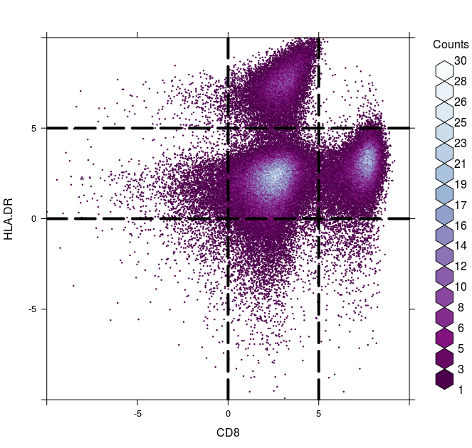
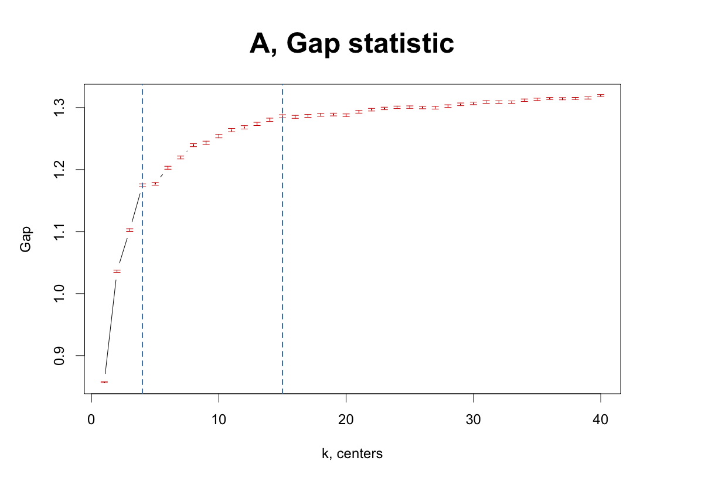
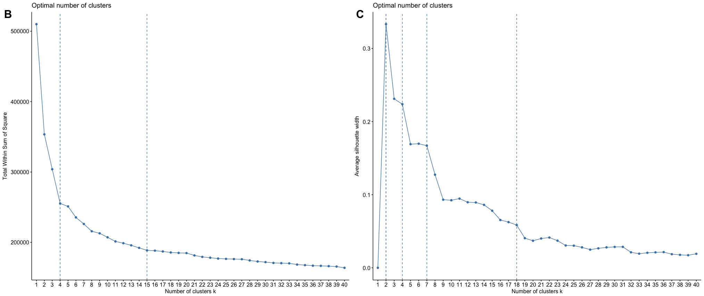
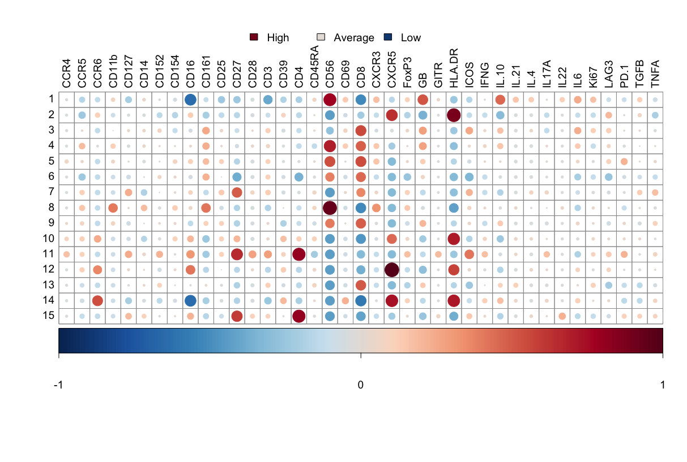

# cytofNet
Unbiased identification of ideal clusters, k, in mass cytometry time-of-flight (CyTOF) data, with interrogation of clusters via network analysis.
<h2>Tutorial</h2>
This tutorial covers just 3 samples (sample1.fcs, sample2.fcs, sample3.fcs) that have already had the basic QC performed on them, e.g., removal of dead cells and manual gating (although, manual gating is supported).
Key points:

 - data is downsampled based on low variance

 - unbiased clustering to identify ideal number of centers, k, is performed via bootstrapped partitioning around medoids (PAM) and 3 metrics: Gap statistic (Tibshirani et al., 2001); silhouette coefficient; elbow method

 - medoids from PAM are ued to infer low/high marker expression

 - network plot construction used to show relationships between identified clusters

<h3>1, setup / initialisation</h3>

```{r}
  #Set CPU cores for parallel-related functions
  cpucores <- 16
  require(parallel)
  options("mc.cores"=cpucores)

  #Set CPU cores for doParallel-related functions
  require(doParallel)
  cores <- makeCluster(detectCores(), type='PSOCK')
  registerDoParallel(cores)
```

<h3>2, set global variables</h3>

```{r}
  #Set background noise threshold - values below this are set to 0
  BackgroundNoiseThreshold <- 1

  #Euclidean norm threshold - this is the square root of the sum of all the squares
  EuclideanNormThreshold <- 1

  #Choose a transformation function (any mathematical function)
  transFun <- function (x) asinh(x)

  #Set hyperbolic arc-sine factor (NB - asinh(x/5) is recommended for CyTOF and FACS data)
  asinhFactor <- 5
```

<h3>3, data input and conversion (FCS -> CSV)</h3>

```{r}
  #Convert FCS to CSV
  require(flowCore)
  
  source("R/fcs2csv.R")
  
  fcs2csv(sample1.fcs, sample1.csv)
  fcs2csv(sample2.fcs, sample2.csv)
  fcs2csv(sample3.fcs, sample3.csv)
  
  sample1 <- read.csv("sample1.csv")
  sample2 <- read.csv("sample2.csv")
  sample3 <- read.csv("sample3.csv")

  #Create a vector of all variable names for the samples
  AllSamples <- c("sample1", "sample2", "sample3")
```

<h3>4, histograms to check distribution of data</h3>

```{r}
  source("R/transform.R")
  
  colours <- c("red", "gold", "skyblue")
  
  par(mfrow=c(1,3), cex=1.2)
  
  for (i in 1:length(AllSamples))
  {
    x <- as.matrix(get(AllSamples[1]))
    x <- x[,-which(colnames(x) %in% c("DNA.1", "DeadLive"))]
    x <- transform(x, BackgroundNoiseThreshold, EuclideanNormThreshold, transFun, asinhFactor)
    
    hist(data.matrix(x), main=paste("Hyperbolic arc-sine\nsample",  i), breaks=30, col=colours[i])
  }
```
</img>

<h3>5, traditional FACS-like plots for pairwise marker comparison and further gating (if needed)</h3>

```{r}
 require(RColorBrewer)
 rf <- colorRampPalette(rev(brewer.pal(9,"BuPu")))

 require(hexbin)
 require(lattice)

 source("R/facsplot.R")

 facsplot("CD8", "HLA.DR", get(AllSamples[1]), bins=400, main="FACS plot", xlim=c(-10,10), ylim=c(-10,10), x1=0, x2=5, y1=0, y2=5, cex=1.0, colramp=rf)
```

</img>

<h3>6a, identify ideal cluster solution via Gap statistic</h3>

```{r}
 x <- as.matrix(get(AllSamples[1]))
 x <- x[,-which(colnames(x) %in% c("DNA.1", "DeadLive"))]
 x <- transform(x, BackgroundNoiseThreshold, EuclideanNormThreshold, transFun, asinhFactor)

 #Define a custom function for PAM (activate 'cluster.only')
 CustomPAM <- function(x,k) list(cluster=pam(x, k, diss=FALSE, metric="manhattan", medoids=NULL, stand=FALSE, cluster.only=TRUE, do.swap=FALSE, keep.diss=FALSE, keep.data=FALSE, pamonce=TRUE, trace.lev=1))

 require(cluster)
 require(fpc)
 
 source("R/findk.R")
 source("R/clusGapKB.R") #parellel processing-enabled version of original clusGap: https://github.com/kevinblighe/clusGapKB
 
 gap <- findk(x=x, varianceFactor=3, FUNcluster=CustomPAM, K.max=40, B=250)

 First SE max=15
 Tibshirani et al. (2001)=15
 Dudoit & Fridlyand (2002)=40
 First max=15
 Global max=40

 gap$Tab
        logW E.logW   gap   SE.sim
  [1,] 10.47   11.3 0.857 0.000703
  [2,] 10.28   11.3 1.036 0.001756
  [3,] 10.20   11.3 1.102 0.002086
  [4,] 10.12   11.3 1.175 0.002316
  [5,] 10.12   11.3 1.177 0.002303
  [6,] 10.09   11.3 1.203 0.002392
  [7,] 10.07   11.3 1.219 0.002329
  [8,] 10.04   11.3 1.239 0.002394
  [9,] 10.03   11.3 1.243 0.002597
 [10,] 10.02   11.3 1.254 0.002776
 [11,] 10.01   11.3 1.264 0.002709
 [12,] 10.00   11.3 1.268 0.002729
 [13,]  9.99   11.3 1.274 0.002594
 [14,]  9.98   11.3 1.280 0.002648
 [15,]  9.98   11.3 1.286 0.002479
 [16,]  9.98   11.3 1.285 0.002383
 [17,]  9.97   11.3 1.287 0.002326
 [18,]  9.97   11.3 1.288 0.002299
 [19,]  9.97   11.3 1.289 0.002210
 [20,]  9.97   11.3 1.288 0.002098
 [21,]  9.96   11.3 1.293 0.002139
 [22,]  9.95   11.3 1.297 0.002105
 [23,]  9.95   11.2 1.299 0.002037
 [24,]  9.95   11.2 1.300 0.001994
 [25,]  9.95   11.2 1.301 0.002015
 [26,]  9.94   11.2 1.300 0.002076
 [27,]  9.94   11.2 1.300 0.002132
 [28,]  9.94   11.2 1.302 0.002164
 [29,]  9.94   11.2 1.305 0.002155
 [30,]  9.93   11.2 1.307 0.002091
 [31,]  9.93   11.2 1.309 0.002076
 [32,]  9.93   11.2 1.309 0.002042
 [33,]  9.93   11.2 1.309 0.001958
 [34,]  9.92   11.2 1.312 0.001975
 [35,]  9.92   11.2 1.313 0.001863
 [36,]  9.92   11.2 1.314 0.001825
 [37,]  9.92   11.2 1.314 0.001767
 [38,]  9.92   11.2 1.315 0.001768
 [39,]  9.92   11.2 1.316 0.001781
 [40,]  9.91   11.2 1.319 0.001781

 par(mar=c(5,5,5,5), cex=1.5)
 plot(gap, main="A, Gap statistic", cex.main=2, adj=0.5, pch=".", xlab="k, centers", ylab="Gap")
 abline(v=4, col="steelblue", lty=2, lwd=2)
 abline(v=15, col="steelblue", lty=2, lwd=2)

```

</img>

<h3>6b, identify ideal cluster solution via silhouette coefficient and elbow method</h3>

```{r} 
 x <- as.matrix(get(AllSamples[1]))
 x <- x[,-which(colnames(x) %in% c("DNA.1", "DeadLive"))]
 x <- transform(x, BackgroundNoiseThreshold, EuclideanNormThreshold, transFun, asinhFactor)

 require(factoextra)
 require(NbClust)

 source("R/findElbowSilhouette.R")
 
 es <- findElbowSilhouette(x=x, varianceFactor=3, K.max=40, B=250)

 require(cowplot)
 
 par(mar=c(5,5,5,5), cex=1.5)
 
 options(scipen=3)
 
 plot_grid(
 	es[[1]] +
  		geom_vline(xintercept=4, linetype=2, colour="steelblue") +
  		geom_vline(xintercept=15, linetype=2, colour="steelblue"),
  
	es[[2]] +
  		geom_vline(xintercept=2, linetype=2, colour="steelblue") +
  		geom_vline(xintercept=4, linetype=2, colour="steelblue") +
		geom_vline(xintercept=7, linetype=2, colour="steelblue") +
  		geom_vline(xintercept=18, linetype=2, colour="steelblue"),
  
	labels=c("B", "C"), vjust=2.25, label_size=24, ncol=2, nrow=1)
 
 options(scipen=999)

```

</img>

<h3>6c, choose ideal cluster solution</h3>
Based on the evidence from clustering, cluster solutions 4 and 15 appear tohave most supporting evidence for the sample processed. For the purposes of this tutorial, we choose 15.

```{r}
 k=15

```

<h3>7, re-perform clustering with the identified number of clusters, k, and plot the signature</h3>

```{r}
x <- as.matrix(get(AllSamples[1]))
x <- x[,-which(colnames(x) %in% c("DNA.1", "DeadLive"))]
x <- transform(x, BackgroundNoiseThreshold, EuclideanNormThreshold, transFun, asinhFactor)

source("R/clusterWithk.R")

#Define a custom function for PAM and cluster at chosen k
CustomPAM <- function(x,k) list(cluster=pam(x, k, diss=FALSE, metric="manhattan", medoids=NULL, stand=FALSE, cluster.only=FALSE, do.swap=TRUE, keep.diss=TRUE, keep.data=TRUE, pamonce=FALSE, trace.lev=1))
gap <- clusterWithk(x=x, varianceFactor=5, FUNcluster=CustomPAM, k=k, lowerPercentile=12.5, upperPercentile=12.5, p=0.05)

[1] "1, 2.89992418498863, CD56+, CD8-CD16-"
[1] "2, 6.29264594389689, HLA.DR+, CD56-GB-IL.10-"
[1] "3, 6.54852160727824, CD8+, HLA.DR-CD56-"
[1] "4, 10.1307808946171, CD56+, HLA.DR-CXCR5-"
[1] "5, 10.2824109173616, CD8+CD56+, CXCR5-"
[1] "6, 5.28335860500379, CD8+CD56+, HLA.DR-CD4-CD27-ICOS-CXCR5-"
[1] "7, 5.5724033358605, CD27+, CD56-"
[1] "8, 4.14613343442002, CD56+, HLA.DR-CD8-"
[1] "9, 11.7181576952237, CD8+CD56+, CXCR5-"
[1] "10, 3.82391963608795, HLA.DR+, CD8-CD56-"
[1] "11, 3.64859742228961, CD4+CD27+, CD8-CD56-CXCR5-"
[1] "12, 10.7136087945413, CXCR5+, CD8-CD56-GB-"
[1] "13, 5.77141774071266, CD8+, CD56-"
[1] "14, 4.33093252463988, HLA.DR+CXCR5+, CD8-CD16-"
[1] "15, 8.83718726307809, CD4+, HLA.DR-CD8-CD56-"

#Plot the signature for each cluster
require(RColorBrewer)
pick.col <- brewer.pal(10, "RdBu")
my_palette <- c(colorRampPalette(rev(pick.col))(200))

source("R/plotSignatures.R")

par(mar=c(1,1,1,1))
plotSignatures(gap, my_palette, cexlab=1.2, cexlegend=1.2, labDegree=80)

```

</img>

<hr>

<h1>References</h1>
Tibshirani R, Walther G, Hastie T (2001), Estimating the number of data clusters via the Gap statistic, Journal of the Royal Statistical Society B. 63: 411–423.

<hr>

<h1>Credits</h1>
<ul>
  <li>Kevin Blighe (University College London)</li>
  <li>Kevin Blighe (Brigham & Women's Hospital / Harvard Medical School)</li>
  <li>Kevin Blighe (Queen Mary University of London)</li>
  <li>Davide Lucchesi (Queen Mary University of London)</li>
</ul>
