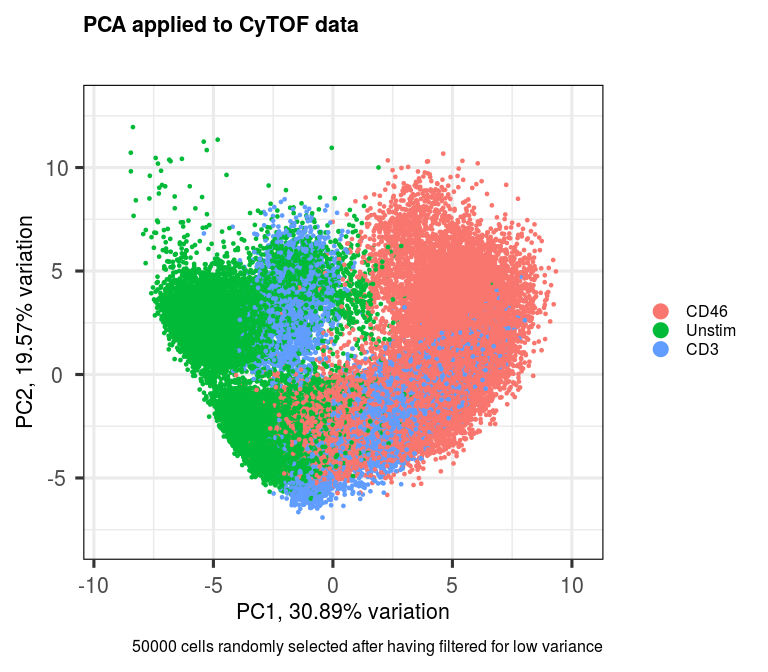
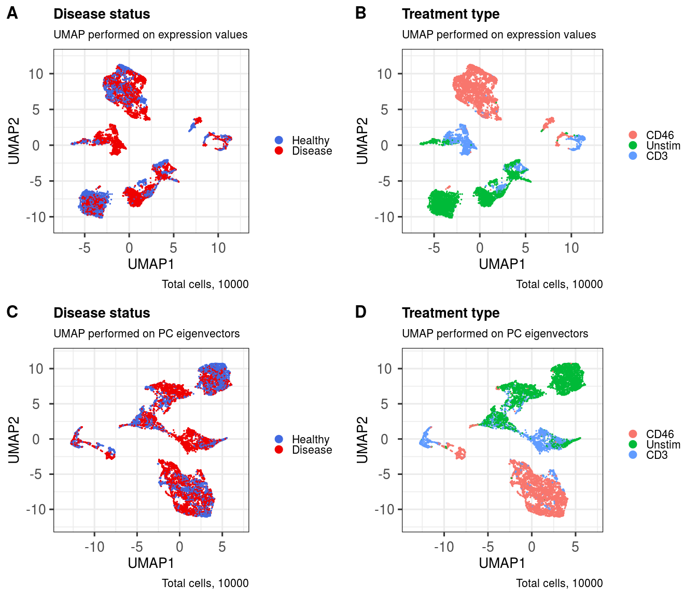

scDataviz: single cell dataviz and downstream analyses
================
Kevin Blighe
2020-08-12

# Introduction

In the single cell World, which includes flow cytometry, mass cytometry,
single-cell RNA-seq (scRNA-seq), and others, there is a need to improve
data visualisation and to bring analysis capabilities to researchers
even from non-technical backgrounds. *scDataviz* (Blighe 2020) attempts
to fit into this space, while also catering for advanced users.
Additonally, due to the way that *scDataviz* is designed, which is based
on *SingleCellExperiment* (Lun and Risso 2020), it has a ‘plug and play’
feel, and immediately lends itself as flexibile and compatibile with
studies that go beyond *scDataviz*. Finally, the graphics in *scDataviz*
are generated via the *ggplot* (Wickham 2016) engine, which means that
users can ‘add on’ features to these with ease.

# Installation

## 1\. Download the package from Bioconductor

``` r
  if (!requireNamespace('BiocManager', quietly = TRUE))
    install.packages('BiocManager')

  BiocManager::install('scDataviz')
```

Note: to install development version:

``` r
  devtools::install_github('kevinblighe/scDataviz')
```

## 2\. Load the package into R session

``` r
  library(scDataviz)
```

# Tutorial 1: CyTOF FCS data

Here, we will utilise some of the flow cytometry data from [Deep
phenotyping detects a pathological CD4+ T-cell complosome signature in
systemic sclerosis](https://www.nature.com/articles/s41423-019-0360-8).

This can normally be downloadedd via `git clone` from your command
prompt:

``` bash

  git clone https://github.com/kevinblighe/scDataviz_data/ ;
```

In a practical situation, we would normally read in this data from the
raw FCS files and then QC filter, normalise, and transform them. This
can be achieved via the `processFCS` function, which, by default, also
removes variables based on low variance and downsamples \[randomly\]
your data to 100000 variables. The user can change these via the
`downsample` and `downsampleVar` parameters. An example (*not run*) is
given below:

``` r
  filelist <- list.files(
    path = "scDataviz_data/FCS/",
    pattern = "*.fcs|*.FCS",
    full.names = TRUE)
  filelist

  metadata <- data.frame(
    sample = gsub('\\ [A-Za-z0-9]*\\.fcs$', '',
      gsub('scDataviz_data\\/FCS\\/\\/', '', filelist)),
    group = c(rep('Healthy', 7), rep('Disease', 11)),
    treatment = gsub('\\.fcs$', '',
      gsub('scDataviz_data\\/FCS\\/\\/[A-Z0-9]*\\ ', '', filelist)),
    row.names = filelist,
    stringsAsFactors = FALSE)
  metadata

  inclusions <- c('Yb171Di','Nd144Di','Nd145Di',
    'Er168Di','Tm169Di','Sm154Di','Yb173Di','Yb174Di',
    'Lu175Di','Nd143Di')

  markernames <- c('Foxp3','C3aR','CD4',
    'CD46','CD25','CD3','Granzyme B','CD55',
    'CD279','CD45RA')

  names(markernames) <- inclusions
  markernames

  exclusions <- c('Time','Event_length','BCKG190Di',
    'Center','Offset','Width','Residual')

  sce <- processFCS(
    files = filelist,
    metadata = metadata,
    transformation = TRUE,
    transFun = function (x) asinh(x),
    asinhFactor = 5,
    downsample = 10000,
    downsampleVar = 0.7,
    colsRetain = inclusions,
    colsDiscard = exclusions,
    newColnames = markernames)
```

In flow and mass cytometry, getting the correct marker names in the FCS
files can be surprisingly difficult. In many cases, from experience, a
facility may label the markers by their metals, such as Iridium (Ir),
Ruthenium (Ru), Terbium (Tb), *et cetera* - this is the case for the
data used in this tutorial. The true marker names may be held as pData
encoded within each FCS, accessible via:

``` r
  library(flowCore)
  pData(parameters(
    read.FCS(filelist[[4]], transformation = FALSE, emptyValue = FALSE)))
```

Whatever the case, it is important to sort out marker naming issues
prior to the experiment being conducted in order to avoid any confusion.

For this vignette, due to the fact that the raw FCS data is \> 500
megabytes, we will work with a smaller pre-prepared dataset that has
been downsampled to 10000 cells using the above code. This data comes
included with the package.

Load the pre-prepared complosome
data.

``` r
  load(system.file('extdata/', 'complosome.rdata', package = 'scDataviz'))
```

One can also create a new *SingleCellExperiment* object manually using
any type of data, including any data from scRNA-seq produced elsewhere.
Import functions for data deriving from other sources is covered in
Tutorials 2 and 3 in this vignette. All functions in *scDataviz*
additionally accept data-frames or matrices on their own,
de-necessitating the reliance on the *SingleCellExperiment* class.

## Perform principal component analysis (PCA)

We can use the *PCAtools* (Blighe and Lun 2020) package for the purpose
of performing PCA.

``` r
  library(PCAtools)
  p <- pca(assay(sce, 'scaled'), metadata = metadata(sce))

  biplot(p,
    x = 'PC1', y = 'PC2',
    lab = NULL,
    xlim = c(min(p$rotated[,'PC1'])-1, max(p$rotated[,'PC1'])+1),
    ylim = c(min(p$rotated[,'PC2'])-1, max(p$rotated[,'PC2'])+1),
    pointSize = 1.0,
    colby = 'treatment',
    legendPosition = 'right',
    title = 'PCA applied to CyTOF data',
    caption = paste0('10000 cells randomly selected after ',
      'having filtered for low variance'))
```



We can add the rotated component loadings as a new reduced dimensional
component to our dataset.

``` r
  reducedDim(sce, 'PCA') <- p$rotated
```

For more functionality via *PCAtools*, check the vignette: [PCAtools:
everything Principal Component
Analysis](https://bioconductor.org/packages/release/bioc/vignettes/PCAtools/inst/doc/PCAtools.html)

## Perform UMAP

UMAP can be performed on the entire dataset, if your computer’s memory
will permit. Currently it’s default is to use the data contained in the
‘scaled’ assay component of your *SingleCellExperiment* object.

``` r
  sce <- performUMAP(sce)
```

UMAP can also be stratified based on a column in your metadata, e.g.,
(treated versus untreated samples); however, to do this, I recommend
creating separate *SingleCellExperiment* objects from the very start,
i.e., from the the data input stage, and processing the data separately
for each group.

**Nota bene** - advanced users may want to change the default
configuration for UMAP. *scDataviz* currently performs UMAP via the
*umap* package. In order to modify the default configuration, one can
pull in the default config separately from the *umap* package and then
modify these config values held in the *umap.defaults* variable, as per
the [umap
vignette](https://cran.r-project.org/web/packages/umap/vignettes/umap.html)
(see ‘Tuning UMAP’ section). For example:

``` r
  config <- umap::umap.defaults
  config$min_dist <- 0.5
  performUMAP(sce, config = config)
```

We can also perform UMAP on a select number of PC eigenvectors.
*PCAtools* (Blighe and Lun 2020) can be used to infer ideal number of
dimensions to use via the elbow method and Horn’s parallel analysis.

``` r
  elbow <- findElbowPoint(p$variance)
  horn <- parallelPCA(assay(sce, 'scaled'))

  elbow
```

    ## PC3 
    ##   3

``` r
  horn$n
```

    ## [1] 1

For now, let’s just use 5 PCs.

``` r
  sce <- performUMAP(sce, reducedDim = 'PCA', dims = c(1:5))
```

## Create a contour plot of the UMAP layout

This and the remaining sections in this tutorial are about producing
great visualisations of the data and attempting to make sense of it,
while not fully overlapping with functionalioty provided by other
programs that operate in tis space.

With the contour plot, we are essentially looking at celluar density. It
can provide for a beautiful viusualisation in a manuscript while also
serving as a useful QC tool: if the density is ‘scrunched up’ into a
single area in the plot space, then there are likely issues with your
input data distribution. We want to see well-separated, high density
‘islands’, or, at least, gradual gradients that blend into one another
across high density ‘peaks’.

``` r
  ggout1 <- contourPlot(sce,
    reducedDim = 'UMAP',
    bins = 150,
    subtitle = 'UMAP performed on expression values',
    legendLabSize = 18,
    axisLabSize = 22,
    titleLabSize = 22,
    subtitleLabSize = 18,
    captionLabSize = 18)

  ggout2 <- contourPlot(sce,
    reducedDim = 'UMAP_PCA',
    bins = 150,
    subtitle = 'UMAP performed on PC eigenvectors',
    legendLabSize = 18,
    axisLabSize = 22,
    titleLabSize = 22,
    subtitleLabSize = 18,
    captionLabSize = 18)

  cowplot::plot_grid(ggout1, ggout2,
    labels = c('A','B'),
    ncol = 2, align = "l", label_size = 24)
```


## Show marker expression across the layout

Here, we randomly select some markers and then plot their expression
profiles across the UMAP layouts.

``` r
  markers <- sample(rownames(sce), 6)
  markers
```

    ## [1] "Foxp3"  "CD4"    "CD45RA" "CD25"   "CD279"  "CD46"

``` r
  ggout1 <- markerExpression(sce,
    markers = markers,
    subtitle = 'UMAP performed on expression values',
    nrow = 1, ncol = 6,
    legendKeyHeight = 1.0,
    legendLabSize = 18,
    stripLabSize = 22,
    axisLabSize = 22,
    titleLabSize = 22,
    subtitleLabSize = 18,
    captionLabSize = 18)

  ggout2 <- markerExpression(sce,
    markers = markers,
    reducedDim = 'UMAP_PCA',
    subtitle = 'UMAP performed on PC eigenvectors',
    nrow = 1, ncol = 6,
    col = c('white', 'darkblue'),
    legendKeyHeight = 1.0,
    legendLabSize = 18,
    stripLabSize = 22,
    axisLabSize = 22,
    titleLabSize = 22,
    subtitleLabSize = 18,
    captionLabSize = 18)

  cowplot::plot_grid(ggout1, ggout2,
    labels = c('A','B'),
    nrow = 2, align = "l", label_size = 24)
```


## Shade cells by metadata

Shading cells by metadata can be useful for identifying any batch
effects, but also useful for visualising, e.g., differences across
treatments.

First, let’s take a look inside the metadata that we have.

``` r
  head(metadata(sce))
```

    ##       sample   group treatment
    ## cell1    P00 Disease    Unstim
    ## cell2    P00 Disease    Unstim
    ## cell3    P04 Disease      CD46
    ## cell4    P03 Disease      CD46
    ## cell5    P08 Disease    Unstim
    ## cell6    P00 Disease      CD46

``` r
  levels(metadata(sce)$group)
```

    ## [1] "Healthy" "Disease"

``` r
  levels(metadata(sce)$treatment)
```

    ## [1] "CD46"   "Unstim" "CD3"

``` r
  ggout1 <- metadataPlot(sce,
    colby = 'group',
    colkey = c(Healthy = 'royalblue', Disease = 'red2'),
    title = 'Disease status',
    subtitle = 'UMAP performed on expression values',
    legendLabSize = 16,
    axisLabSize = 20,
    titleLabSize = 20,
    subtitleLabSize = 16,
    captionLabSize = 16)

  ggout2 <- metadataPlot(sce,
    reducedDim = 'UMAP_PCA',
    colby = 'group',
    colkey = c(Healthy = 'royalblue', Disease = 'red2'),
    title = 'Disease status',
    subtitle = 'UMAP performed on PC eigenvectors',
    legendLabSize = 16,
    axisLabSize = 20,
    titleLabSize = 20,
    subtitleLabSize = 16,
    captionLabSize = 16)

  ggout3 <- metadataPlot(sce,
    colby = 'treatment',
    title = 'Treatment type',
    subtitle = 'UMAP performed on expression values',
    legendLabSize = 16,
    axisLabSize = 20,
    titleLabSize = 20,
    subtitleLabSize = 16,
    captionLabSize = 16)

  ggout4 <- metadataPlot(sce,
    reducedDim = 'UMAP_PCA',
    colby = 'treatment',
    title = 'Treatment type',
    subtitle = 'UMAP performed on PC eigenvectors',
    legendLabSize = 16,
    axisLabSize = 20,
    titleLabSize = 20,
    subtitleLabSize = 16,
    captionLabSize = 16)

  cowplot::plot_grid(ggout1, ggout3, ggout2, ggout4,
    labels = c('A','B','C','D'),
    nrow = 2, ncol = 2, align = "l", label_size = 24)
```



## Find ideal clusters in the UMAP layout via k-nearest neighbours

This function utilises the k nearest neighbours (k-NN) approach from
Seurat, which works quite well on flow cytometry and CyTOF UMAP layouts,
from my experience.

``` r
  sce <- clusKNN(sce,
    k.param = 20,
    prune.SNN = 1/15,
    resolution = 0.01,
    algorithm = 2,
    verbose = FALSE)

  sce <- clusKNN(sce,
    reducedDim = 'UMAP_PCA',
    clusterAssignName = 'Cluster_PCA',
    k.param = 20,
    prune.SNN = 1/15,
    resolution = 0.01,
    algorithm = 2,
    verbose = FALSE)

  ggout1 <- plotClusters(sce,
    clusterColname = 'Cluster',
    labSize = 7.0,
    subtitle = 'UMAP performed on expression values',
    caption = paste0('Note: clusters / communities identified via',
      '\nLouvain algorithm with multilevel refinement'),
    axisLabSize = 20,
    titleLabSize = 20,
    subtitleLabSize = 16,
    captionLabSize = 16)

  ggout2 <- plotClusters(sce,
    clusterColname = 'Cluster_PCA',
    reducedDim = 'UMAP_PCA',
    labSize = 7.0,
    subtitle = 'UMAP performed on PC eigenvectors',
    caption = paste0('Note: clusters / communities identified via',
      '\nLouvain algorithm with multilevel refinement'),
    axisLabSize = 20,
    titleLabSize = 20,
    subtitleLabSize = 16,
    captionLabSize = 16)

  cowplot::plot_grid(ggout1, ggout2,
    labels = c('A','B'),
    ncol = 2, align = "l", label_size = 24)
```


## Plot marker expression per identified cluster

``` r
  markerExpressionPerCluster(sce,
    caption = 'Cluster assignments based on UMAP performed on expression values',
    stripLabSize = 22,
    axisLabSize = 22,
    titleLabSize = 22,
    subtitleLabSize = 18,
    captionLabSize = 18)
```

``` r
  clusters <- unique(metadata(sce)[['Cluster_PCA']])
  clusters
```

    ## [1] 2 0 1 6 4 3 5 7

``` r
  markers <- sample(rownames(sce), 5)
  markers
```

    ## [1] "Foxp3"  "C3aR"   "CD25"   "CD45RA" "CD3"

``` r
  markerExpressionPerCluster(sce,
    clusters = clusters,
    clusterAssign = metadata(sce)[['Cluster_PCA']],
    markers = markers,
    nrow = 2, ncol = 5,
    caption = 'Cluster assignments based on UMAP performed on PC eigenvectors',
    stripLabSize = 22,
    axisLabSize = 22,
    titleLabSize = 22,
    subtitleLabSize = 18,
    captionLabSize = 18)
```


Try all markers across a single cluster:

``` r
  cluster <- sample(unique(metadata(sce)[['Cluster']]), 1)
  cluster
```

    ## [1] 1

``` r
  markerExpressionPerCluster(sce,
    clusters = cluster,
    markers = rownames(sce),
    stripLabSize = 20,
    axisLabSize = 20,
    titleLabSize = 20,
    subtitleLabSize = 14,
    captionLabSize = 12)
```


## Determine enriched markers in each cluster and plot the expression signature

This method also calculates metacluster abundances across a chosen
phenotype. The function returns a data-frame, which can then be exported
to do other analyses.

### Disease vs Healthy metacluster abundances

``` r
  markerEnrichment(sce,
    method = 'quantile',
    studyvarID = 'group')
```

<table class="table" style="width: auto !important; margin-left: auto; margin-right: auto;">

<thead>

<tr>

<th style="text-align:right;">

Cluster

</th>

<th style="text-align:right;">

nCells

</th>

<th style="text-align:right;">

TotalCells

</th>

<th style="text-align:right;">

PercentCells

</th>

<th style="text-align:left;">

NegMarkers

</th>

<th style="text-align:left;">

PosMarkers

</th>

<th style="text-align:right;">

PerCent\_HD00

</th>

<th style="text-align:right;">

PerCent\_HD01

</th>

<th style="text-align:right;">

PerCent\_HD262

</th>

<th style="text-align:right;">

PerCent\_P00

</th>

<th style="text-align:right;">

PerCent\_P02

</th>

<th style="text-align:right;">

PerCent\_P03

</th>

<th style="text-align:right;">

PerCent\_P04

</th>

<th style="text-align:right;">

PerCent\_P08

</th>

<th style="text-align:right;">

nCell\_Healthy

</th>

<th style="text-align:right;">

nCell\_Disease

</th>

</tr>

</thead>

<tbody>

<tr>

<td style="text-align:right;">

0

</td>

<td style="text-align:right;">

3410

</td>

<td style="text-align:right;">

10000

</td>

<td style="text-align:right;">

34.10

</td>

<td style="text-align:left;">

NA

</td>

<td style="text-align:left;">

CD25+

</td>

<td style="text-align:right;">

0.0879765

</td>

<td style="text-align:right;">

9.6187683

</td>

<td style="text-align:right;">

25.483871

</td>

<td style="text-align:right;">

22.8152493

</td>

<td style="text-align:right;">

8.3870968

</td>

<td style="text-align:right;">

8.8563050

</td>

<td style="text-align:right;">

17.7126100

</td>

<td style="text-align:right;">

7.0381232

</td>

<td style="text-align:right;">

1200

</td>

<td style="text-align:right;">

2210

</td>

</tr>

<tr>

<td style="text-align:right;">

1

</td>

<td style="text-align:right;">

1928

</td>

<td style="text-align:right;">

10000

</td>

<td style="text-align:right;">

19.28

</td>

<td style="text-align:left;">

CD25-CD279-

</td>

<td style="text-align:left;">

CD3+CD45RA+

</td>

<td style="text-align:right;">

0.0000000

</td>

<td style="text-align:right;">

0.1556017

</td>

<td style="text-align:right;">

62.085062

</td>

<td style="text-align:right;">

0.5705394

</td>

<td style="text-align:right;">

0.2074689

</td>

<td style="text-align:right;">

0.0000000

</td>

<td style="text-align:right;">

0.0518672

</td>

<td style="text-align:right;">

36.9294606

</td>

<td style="text-align:right;">

1200

</td>

<td style="text-align:right;">

728

</td>

</tr>

<tr>

<td style="text-align:right;">

2

</td>

<td style="text-align:right;">

1298

</td>

<td style="text-align:right;">

10000

</td>

<td style="text-align:right;">

12.98

</td>

<td style="text-align:left;">

Granzyme B-CD279-

</td>

<td style="text-align:left;">

CD3+

</td>

<td style="text-align:right;">

15.6394453

</td>

<td style="text-align:right;">

7.8582435

</td>

<td style="text-align:right;">

2.234206

</td>

<td style="text-align:right;">

64.1756549

</td>

<td style="text-align:right;">

3.8520801

</td>

<td style="text-align:right;">

3.5439137

</td>

<td style="text-align:right;">

1.9260401

</td>

<td style="text-align:right;">

0.7704160

</td>

<td style="text-align:right;">

334

</td>

<td style="text-align:right;">

964

</td>

</tr>

<tr>

<td style="text-align:right;">

3

</td>

<td style="text-align:right;">

1236

</td>

<td style="text-align:right;">

10000

</td>

<td style="text-align:right;">

12.36

</td>

<td style="text-align:left;">

NA

</td>

<td style="text-align:left;">

CD25+

</td>

<td style="text-align:right;">

6.3915858

</td>

<td style="text-align:right;">

1.1326861

</td>

<td style="text-align:right;">

1.375404

</td>

<td style="text-align:right;">

2.9126214

</td>

<td style="text-align:right;">

24.0291262

</td>

<td style="text-align:right;">

7.0388350

</td>

<td style="text-align:right;">

56.8770227

</td>

<td style="text-align:right;">

0.2427184

</td>

<td style="text-align:right;">

110

</td>

<td style="text-align:right;">

1126

</td>

</tr>

<tr>

<td style="text-align:right;">

4

</td>

<td style="text-align:right;">

962

</td>

<td style="text-align:right;">

10000

</td>

<td style="text-align:right;">

9.62

</td>

<td style="text-align:left;">

NA

</td>

<td style="text-align:left;">

CD3+

</td>

<td style="text-align:right;">

16.5280665

</td>

<td style="text-align:right;">

26.1954262

</td>

<td style="text-align:right;">

7.484407

</td>

<td style="text-align:right;">

27.9625780

</td>

<td style="text-align:right;">

3.2224532

</td>

<td style="text-align:right;">

10.0831601

</td>

<td style="text-align:right;">

6.0291060

</td>

<td style="text-align:right;">

2.4948025

</td>

<td style="text-align:right;">

483

</td>

<td style="text-align:right;">

479

</td>

</tr>

<tr>

<td style="text-align:right;">

5

</td>

<td style="text-align:right;">

502

</td>

<td style="text-align:right;">

10000

</td>

<td style="text-align:right;">

5.02

</td>

<td style="text-align:left;">

CD25-

</td>

<td style="text-align:left;">

NA

</td>

<td style="text-align:right;">

0.3984064

</td>

<td style="text-align:right;">

14.9402390

</td>

<td style="text-align:right;">

40.836653

</td>

<td style="text-align:right;">

11.1553785

</td>

<td style="text-align:right;">

0.0000000

</td>

<td style="text-align:right;">

0.3984064

</td>

<td style="text-align:right;">

0.1992032

</td>

<td style="text-align:right;">

32.0717131

</td>

<td style="text-align:right;">

282

</td>

<td style="text-align:right;">

220

</td>

</tr>

<tr>

<td style="text-align:right;">

6

</td>

<td style="text-align:right;">

300

</td>

<td style="text-align:right;">

10000

</td>

<td style="text-align:right;">

3.00

</td>

<td style="text-align:left;">

CD46-CD279-

</td>

<td style="text-align:left;">

NA

</td>

<td style="text-align:right;">

0.0000000

</td>

<td style="text-align:right;">

41.0000000

</td>

<td style="text-align:right;">

2.000000

</td>

<td style="text-align:right;">

54.6666667

</td>

<td style="text-align:right;">

0.3333333

</td>

<td style="text-align:right;">

0.3333333

</td>

<td style="text-align:right;">

0.6666667

</td>

<td style="text-align:right;">

1.0000000

</td>

<td style="text-align:right;">

129

</td>

<td style="text-align:right;">

171

</td>

</tr>

<tr>

<td style="text-align:right;">

7

</td>

<td style="text-align:right;">

281

</td>

<td style="text-align:right;">

10000

</td>

<td style="text-align:right;">

2.81

</td>

<td style="text-align:left;">

NA

</td>

<td style="text-align:left;">

Foxp3+CD25+CD3+

</td>

<td style="text-align:right;">

0.3558719

</td>

<td style="text-align:right;">

0.0000000

</td>

<td style="text-align:right;">

70.462633

</td>

<td style="text-align:right;">

2.1352313

</td>

<td style="text-align:right;">

0.7117438

</td>

<td style="text-align:right;">

0.7117438

</td>

<td style="text-align:right;">

0.3558719

</td>

<td style="text-align:right;">

25.2669039

</td>

<td style="text-align:right;">

199

</td>

<td style="text-align:right;">

82

</td>

</tr>

<tr>

<td style="text-align:right;">

8

</td>

<td style="text-align:right;">

61

</td>

<td style="text-align:right;">

10000

</td>

<td style="text-align:right;">

0.61

</td>

<td style="text-align:left;">

CD46-

</td>

<td style="text-align:left;">

NA

</td>

<td style="text-align:right;">

0.0000000

</td>

<td style="text-align:right;">

18.0327869

</td>

<td style="text-align:right;">

1.639344

</td>

<td style="text-align:right;">

0.0000000

</td>

<td style="text-align:right;">

1.6393443

</td>

<td style="text-align:right;">

78.6885246

</td>

<td style="text-align:right;">

0.0000000

</td>

<td style="text-align:right;">

0.0000000

</td>

<td style="text-align:right;">

12

</td>

<td style="text-align:right;">

49

</td>

</tr>

<tr>

<td style="text-align:right;">

9

</td>

<td style="text-align:right;">

22

</td>

<td style="text-align:right;">

10000

</td>

<td style="text-align:right;">

0.22

</td>

<td style="text-align:left;">

CD46-CD279-

</td>

<td style="text-align:left;">

CD3+

</td>

<td style="text-align:right;">

0.0000000

</td>

<td style="text-align:right;">

18.1818182

</td>

<td style="text-align:right;">

4.545454

</td>

<td style="text-align:right;">

0.0000000

</td>

<td style="text-align:right;">

0.0000000

</td>

<td style="text-align:right;">

77.2727273

</td>

<td style="text-align:right;">

0.0000000

</td>

<td style="text-align:right;">

0.0000000

</td>

<td style="text-align:right;">

5

</td>

<td style="text-align:right;">

17

</td>

</tr>

</tbody>

</table>

.

### Treatment type metacluster abundances

``` r
  markerEnrichment(sce,
    sampleAbundances = FALSE,
    method = 'quantile',
    studyvarID = 'treatment')
```

<table class="table" style="width: auto !important; margin-left: auto; margin-right: auto;">

<thead>

<tr>

<th style="text-align:right;">

Cluster

</th>

<th style="text-align:right;">

nCells

</th>

<th style="text-align:right;">

TotalCells

</th>

<th style="text-align:right;">

PercentCells

</th>

<th style="text-align:left;">

NegMarkers

</th>

<th style="text-align:left;">

PosMarkers

</th>

<th style="text-align:right;">

nCell\_CD46

</th>

<th style="text-align:right;">

nCell\_Unstim

</th>

<th style="text-align:right;">

nCell\_CD3

</th>

</tr>

</thead>

<tbody>

<tr>

<td style="text-align:right;">

0

</td>

<td style="text-align:right;">

3410

</td>

<td style="text-align:right;">

10000

</td>

<td style="text-align:right;">

34.10

</td>

<td style="text-align:left;">

NA

</td>

<td style="text-align:left;">

CD25+

</td>

<td style="text-align:right;">

3384

</td>

<td style="text-align:right;">

2

</td>

<td style="text-align:right;">

24

</td>

</tr>

<tr>

<td style="text-align:right;">

1

</td>

<td style="text-align:right;">

1928

</td>

<td style="text-align:right;">

10000

</td>

<td style="text-align:right;">

19.28

</td>

<td style="text-align:left;">

CD25-CD279-

</td>

<td style="text-align:left;">

CD3+CD45RA+

</td>

<td style="text-align:right;">

3

</td>

<td style="text-align:right;">

1921

</td>

<td style="text-align:right;">

4

</td>

</tr>

<tr>

<td style="text-align:right;">

2

</td>

<td style="text-align:right;">

1298

</td>

<td style="text-align:right;">

10000

</td>

<td style="text-align:right;">

12.98

</td>

<td style="text-align:left;">

Granzyme B-CD279-

</td>

<td style="text-align:left;">

CD3+

</td>

<td style="text-align:right;">

5

</td>

<td style="text-align:right;">

1172

</td>

<td style="text-align:right;">

121

</td>

</tr>

<tr>

<td style="text-align:right;">

3

</td>

<td style="text-align:right;">

1236

</td>

<td style="text-align:right;">

10000

</td>

<td style="text-align:right;">

12.36

</td>

<td style="text-align:left;">

NA

</td>

<td style="text-align:left;">

CD25+

</td>

<td style="text-align:right;">

21

</td>

<td style="text-align:right;">

132

</td>

<td style="text-align:right;">

1083

</td>

</tr>

<tr>

<td style="text-align:right;">

4

</td>

<td style="text-align:right;">

962

</td>

<td style="text-align:right;">

10000

</td>

<td style="text-align:right;">

9.62

</td>

<td style="text-align:left;">

NA

</td>

<td style="text-align:left;">

CD3+

</td>

<td style="text-align:right;">

4

</td>

<td style="text-align:right;">

771

</td>

<td style="text-align:right;">

187

</td>

</tr>

<tr>

<td style="text-align:right;">

5

</td>

<td style="text-align:right;">

502

</td>

<td style="text-align:right;">

10000

</td>

<td style="text-align:right;">

5.02

</td>

<td style="text-align:left;">

CD25-

</td>

<td style="text-align:left;">

NA

</td>

<td style="text-align:right;">

112

</td>

<td style="text-align:right;">

24

</td>

<td style="text-align:right;">

366

</td>

</tr>

<tr>

<td style="text-align:right;">

6

</td>

<td style="text-align:right;">

300

</td>

<td style="text-align:right;">

10000

</td>

<td style="text-align:right;">

3.00

</td>

<td style="text-align:left;">

CD46-CD279-

</td>

<td style="text-align:left;">

NA

</td>

<td style="text-align:right;">

288

</td>

<td style="text-align:right;">

10

</td>

<td style="text-align:right;">

2

</td>

</tr>

<tr>

<td style="text-align:right;">

7

</td>

<td style="text-align:right;">

281

</td>

<td style="text-align:right;">

10000

</td>

<td style="text-align:right;">

2.81

</td>

<td style="text-align:left;">

NA

</td>

<td style="text-align:left;">

Foxp3+CD25+CD3+

</td>

<td style="text-align:right;">

2

</td>

<td style="text-align:right;">

276

</td>

<td style="text-align:right;">

3

</td>

</tr>

<tr>

<td style="text-align:right;">

8

</td>

<td style="text-align:right;">

61

</td>

<td style="text-align:right;">

10000

</td>

<td style="text-align:right;">

0.61

</td>

<td style="text-align:left;">

CD46-

</td>

<td style="text-align:left;">

NA

</td>

<td style="text-align:right;">

57

</td>

<td style="text-align:right;">

4

</td>

<td style="text-align:right;">

0

</td>

</tr>

<tr>

<td style="text-align:right;">

9

</td>

<td style="text-align:right;">

22

</td>

<td style="text-align:right;">

10000

</td>

<td style="text-align:right;">

0.22

</td>

<td style="text-align:left;">

CD46-CD279-

</td>

<td style="text-align:left;">

CD3+

</td>

<td style="text-align:right;">

21

</td>

<td style="text-align:right;">

1

</td>

<td style="text-align:right;">

0

</td>

</tr>

</tbody>

</table>

.

### Expression signature

The expression signature is a quick way to visualise which markers are
more or less expressed in each identified cluster of cells.

``` r
  plotSignatures(sce,
    labCex = 1.2,
    legendCex = 1.2,
    labDegree = 40)
```


# Tutorial 2: Import from Seurat

Due to the fact that *scDataviz* is based on *SingleCellExperiment*, it
has increased interoperability with other packages, including the
popular *Seurat* (Stuart et al. 2018). Taking the data produced from the
[Seurat
Tutorial](https://satijalab.org/seurat/v3.1/pbmc3k_tutorial.html) on
Peripheral Blood Mononuclear Cells (PBMCs), we can convert this to a
*SingleCellExperiment* object recognisable by *scDataviz* via
`as.SingleCellExperiment()`.


# Tutorial 3: Import any numerical data

*scDataviz* will work with any numerical data, too. Here, we show a
quick example of how one can import a data-matrix of randomly-generated
numbers that follow a negative binomial distribution, comprising 2500
cells and 20 markers:

``` r
  mat <- jitter(matrix(
    MASS::rnegbin(rexp(50000, rate=.1), theta = 4.5),
    ncol = 20))
  colnames(mat) <- paste0('CD', 1:ncol(mat))
  rownames(mat) <- paste0('cell', 1:nrow(mat))

  metadata <- data.frame(
    group = rep('A', nrow(mat)),
    row.names = rownames(mat),
    stringsAsFactors = FALSE)
  head(metadata)
```

    ##       group
    ## cell1     A
    ## cell2     A
    ## cell3     A
    ## cell4     A
    ## cell5     A
    ## cell6     A

``` r
  sce <- importData(mat,
    assayname = 'normcounts',
    metadata = metadata)
  sce
```

    ## class: SingleCellExperiment 
    ## dim: 20 2500 
    ## metadata(1): group
    ## assays(1): normcounts
    ## rownames(20): CD1 CD2 ... CD19 CD20
    ## rowData names(0):
    ## colnames(2500): cell1 cell2 ... cell2499 cell2500
    ## colData names(0):
    ## reducedDimNames(0):
    ## altExpNames(0):

This will also work without any assigned metadata.

``` r
  sce <- importData(mat,
    assayname = 'normcounts',
    metadata = NULL)
  sce
```

    ## class: SingleCellExperiment 
    ## dim: 20 2500 
    ## metadata(0):
    ## assays(1): normcounts
    ## rownames(20): CD1 CD2 ... CD19 CD20
    ## rowData names(0):
    ## colnames(2500): cell1 cell2 ... cell2499 cell2500
    ## colData names(0):
    ## reducedDimNames(0):
    ## altExpNames(0):

# Acknowledgments

  - Jessica Timms
  - James Opzoomer
  - Shahram Kordasti
  - Marcel Ramos (Bioconductor)
  - Lori Shepherd (Bioconductor)
  - Bioinformatics CRO
  - Henrik Bengtsson

# Session info

``` r
sessionInfo()
```

    ## R version 4.0.2 (2020-06-22)
    ## Platform: x86_64-pc-linux-gnu (64-bit)
    ## Running under: Ubuntu 16.04.7 LTS
    ## 
    ## Matrix products: default
    ## BLAS:   /usr/lib/atlas-base/atlas/libblas.so.3.0
    ## LAPACK: /usr/lib/atlas-base/atlas/liblapack.so.3.0
    ## 
    ## locale:
    ##  [1] LC_CTYPE=pt_BR.UTF-8       LC_NUMERIC=C              
    ##  [3] LC_TIME=en_GB.UTF-8        LC_COLLATE=pt_BR.UTF-8    
    ##  [5] LC_MONETARY=en_GB.UTF-8    LC_MESSAGES=pt_BR.UTF-8   
    ##  [7] LC_PAPER=en_GB.UTF-8       LC_NAME=C                 
    ##  [9] LC_ADDRESS=C               LC_TELEPHONE=C            
    ## [11] LC_MEASUREMENT=en_GB.UTF-8 LC_IDENTIFICATION=C       
    ## 
    ## attached base packages:
    ## [1] parallel  stats4    stats     graphics  grDevices utils     datasets 
    ## [8] methods   base     
    ## 
    ## other attached packages:
    ##  [1] PCAtools_2.1.22             ggrepel_0.8.2              
    ##  [3] ggplot2_3.3.2               scDataviz_0.99.60          
    ##  [5] SingleCellExperiment_1.11.6 SummarizedExperiment_1.18.1
    ##  [7] DelayedArray_0.14.0         matrixStats_0.56.0         
    ##  [9] Biobase_2.48.0              GenomicRanges_1.40.0       
    ## [11] GenomeInfoDb_1.24.2         IRanges_2.22.2             
    ## [13] S4Vectors_0.26.1            BiocGenerics_0.34.0        
    ## [15] kableExtra_1.1.0            knitr_1.29                 
    ## 
    ## loaded via a namespace (and not attached):
    ##   [1] Seurat_3.1.5              Rtsne_0.15               
    ##   [3] colorspace_1.4-1          ellipsis_0.3.1           
    ##   [5] ggridges_0.5.2            cytolib_2.0.3            
    ##   [7] XVector_0.28.0            rstudioapi_0.11          
    ##   [9] farver_2.0.3              leiden_0.3.3             
    ##  [11] listenv_0.8.0             RSpectra_0.16-0          
    ##  [13] xml2_1.3.2                codetools_0.2-16         
    ##  [15] splines_4.0.2             jsonlite_1.7.0           
    ##  [17] umap_0.2.6.0              ica_1.0-2                
    ##  [19] cluster_2.1.0             png_0.1-7                
    ##  [21] uwot_0.1.8                sctransform_0.2.1        
    ##  [23] readr_1.3.1               compiler_4.0.2           
    ##  [25] httr_1.4.1                dqrng_0.2.1              
    ##  [27] Matrix_1.2-18             lazyeval_0.2.2           
    ##  [29] BiocSingular_1.4.0        htmltools_0.5.0          
    ##  [31] tools_4.0.2               rsvd_1.0.3               
    ##  [33] igraph_1.2.5              gtable_0.3.0             
    ##  [35] glue_1.4.1                GenomeInfoDbData_1.2.3   
    ##  [37] RANN_2.6.1                reshape2_1.4.4           
    ##  [39] dplyr_1.0.0               rappdirs_0.3.1           
    ##  [41] Rcpp_1.0.4.6              vctrs_0.3.1              
    ##  [43] ape_5.4                   nlme_3.1-147             
    ##  [45] DelayedMatrixStats_1.10.0 lmtest_0.9-37            
    ##  [47] xfun_0.15                 stringr_1.4.0            
    ##  [49] globals_0.12.5            rvest_0.3.5              
    ##  [51] lifecycle_0.2.0           irlba_2.3.3              
    ##  [53] future_1.17.0             zlibbioc_1.34.0          
    ##  [55] MASS_7.3-51.6             zoo_1.8-8                
    ##  [57] scales_1.1.1              RProtoBufLib_2.0.0       
    ##  [59] hms_0.5.3                 RColorBrewer_1.1-2       
    ##  [61] yaml_2.2.1                reticulate_1.16          
    ##  [63] pbapply_1.4-2             gridExtra_2.3            
    ##  [65] stringi_1.4.6             highr_0.8                
    ##  [67] corrplot_0.84             flowCore_2.0.1           
    ##  [69] BiocParallel_1.22.0       rlang_0.4.6              
    ##  [71] pkgconfig_2.0.3           bitops_1.0-6             
    ##  [73] evaluate_0.14             lattice_0.20-41          
    ##  [75] ROCR_1.0-11               purrr_0.3.4              
    ##  [77] labeling_0.3              patchwork_1.0.1          
    ##  [79] htmlwidgets_1.5.1         cowplot_1.0.0            
    ##  [81] tidyselect_1.1.0          RcppAnnoy_0.0.16         
    ##  [83] plyr_1.8.6                magrittr_1.5             
    ##  [85] R6_2.4.1                  generics_0.0.2           
    ##  [87] withr_2.2.0               pillar_1.4.4             
    ##  [89] fitdistrplus_1.1-1        survival_3.2-3           
    ##  [91] RCurl_1.98-1.2            tibble_3.0.1             
    ##  [93] future.apply_1.5.0        tsne_0.1-3               
    ##  [95] crayon_1.3.4              KernSmooth_2.23-17       
    ##  [97] plotly_4.9.2.1            rmarkdown_2.3            
    ##  [99] isoband_0.2.2             grid_4.0.2               
    ## [101] data.table_1.12.8         digest_0.6.25            
    ## [103] webshot_0.5.2             tidyr_1.1.0              
    ## [105] openssl_1.4.1             RcppParallel_5.0.2       
    ## [107] munsell_0.5.0             viridisLite_0.3.0        
    ## [109] askpass_1.1

# References

Blighe (2020)

Blighe and Lun (2020)

Lun and Risso (2020)

Stuart et al. (2018)

Wickham (2016)

<div id="refs" class="references">

<div id="ref-scDataviz">

Blighe, K. 2020. “scDataviz: single cell dataviz and downstream
analyses.” <https://github.com/kevinblighe/scDataviz.>

</div>

<div id="ref-PCAtools">

Blighe, K, and A Lun. 2020. “PCAtools: everything Principal Component
Analysis.” <https://github.com/kevinblighe/PCAtools.>

</div>

<div id="ref-Lun">

Lun, A, and D Risso. 2020. “SingleCellExperiment: S4 Classes for Single
Cell Data.” <https://bioconductor.org/packages/SingleCellExperiment.>

</div>

<div id="ref-satijalab">

Stuart, Tim, Andrew Butler, Paul Hoffman, Christoph Hafemeister,
Efthymia Papalexi, William M Mauck III, Marlon Stoeckius, Peter Smibert,
and Rahul Satija. 2018. “Comprehensive Integration of Single Cell Data.”
*bioRxiv*. <https://doi.org/10.1101/460147>.

</div>

<div id="ref-Wickham">

Wickham, H. 2016. “ggplot2: Elegant Graphics for Data Analysis.”
Springer-Verlag New York, ISBN: 978-3-319-24277-4.

</div>

</div>
